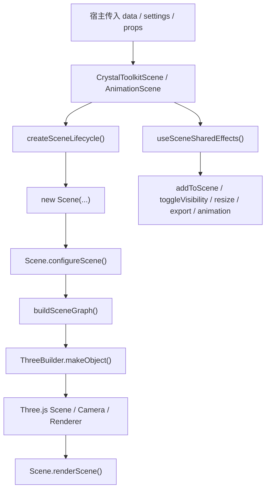

# matsci-crystal-viewer-kit

`@gnosys/matsci-crystal-viewer-kit` 是一个面向材料结构展示场景的 React + Three.js 组件包，提供完整的晶体结构 3D viewer 运行时、工具栏、设置面板挂载位、图例挂载位、截图与模型导出能力。

它不是一个“页面级应用组件集合”，而是一个专注于晶体结构可视化的底层能力包。你可以把它理解为：

- 一个以 `Scene JSON` 为输入的数据驱动 3D 渲染运行时
- 一个可独立发布、可复用、可被宿主产品接入的晶体结构 viewer shell
- 一个已经完成过一轮生命周期、性能和展示优化收敛的工程化组件库

如果你只是想快速接入，直接看“快速开始”和“常用 Props”。  
如果你要维护、扩展、写技术博客、写汇报材料或整理软著说明，建议从“设计目标”“架构概览”“高性能设计”开始。

## 目录

1. [项目定位](#项目定位)
2. [核心特性](#核心特性)
3. [为什么这个包值得单独存在](#为什么这个包值得单独存在)
4. [安装](#安装)
5. [对外导出](#对外导出)
6. [快速开始](#快速开始)
7. [常用 Props](#常用-props)
8. [Scene JSON 输入模型](#scene-json-输入模型)
9. [组件与架构概览](#组件与架构概览)
10. [核心运行链路](#核心运行链路)
11. [高性能设计与已实现优化](#高性能设计与已实现优化)
12. [交互与展示能力](#交互与展示能力)
13. [样式系统与宿主覆盖](#样式系统与宿主覆盖)
14. [导出能力](#导出能力)
15. [宿主集成建议](#宿主集成建议)
16. [开发命令](#开发命令)
17. [发布](#发布)
18. [路线图与后续优化方向](#路线图与后续优化方向)

## 项目定位

`matsci-crystal-viewer-kit` 从 `matsci-ui` 中抽离出来，目标非常明确：

- 接收宿主传入的 `Scene JSON`
- 在 React 中创建和维护一个可交互的 Three.js 场景
- 提供产品可用的 viewer 外壳，而不只是裸画布
- 允许宿主通过 props、children、文案和样式覆盖进行业务定制

它负责：

- 原子、键、晶胞、箭头、多面体、表面、标签等 3D 对象的统一渲染
- 旋转、缩放、点击选择、选中高亮、视角复位等 viewer 行为
- 工具栏、全屏、截图、导出、设置面板、图例挂载位
- 普通结构场景、通用动画场景、声子动画场景三类主路径

它不负责：

- 材料搜索页面本身
- 周期表与检索 UI
- 后端请求和数据缓存
- 将 CIF / 结构对象转成 Scene JSON 的上游业务逻辑

换句话说，这个包的职责是“晶体结构 viewer runtime + viewer shell”，而不是“完整材料平台前端”。

## 核心特性

当前版本已经具备一套完整、可交付的晶体结构查看器能力：

- 支持数据驱动渲染，输入是易于后端生成和传输的 `Scene JSON`
- 支持多种结构对象类型，包括 `spheres`、`cylinders`、`lines`、`arrows`、`convex`、`surface`、`labels`、`ellipsoids`、`bezier`
- 支持普通静态场景、滑杆动画场景、播放动画场景和声子振动动画场景
- 支持对象点击、单选/多选、outline 高亮、tooltip、inset 二级视图联动
- 支持截图导出、场景导出、宿主自定义导出菜单项
- 支持 settings panel 与 legend panel 作为宿主可插拔区域
- 支持本地 CSS 样式体系，不依赖 Less
- 支持在宿主中以 npm 包形式长期维护和升级

## 为什么这个包值得单独存在

这个包之所以值得被独立抽出来，不是因为“能画一个 3D 场景”，而是因为它已经具备了几个工程上很关键的特征：

- 生命周期完整：初始化、挂载、尺寸同步、销毁、全屏切换、动画切换都已收口
- 性能路径清晰：全屏不重建 Scene、ResizeObserver 统一尺寸同步、outline 改为 dirty-driven、viewport 配置不再每帧重复
- 模块边界清楚：交互、命中测试、选择、高亮、相机 framing、controls 已经拆成独立子模块
- 宿主友好：样式可覆盖、文案可覆盖、children 可挂载、导出链路可透传

这意味着它不再只是“某个页面里长出来的 3D 组件”，而是一个可以在多个宿主项目中复用的结构展示基础设施。

## 安装

```bash
pnpm add @gnosys/matsci-crystal-viewer-kit
```

当前 `peerDependencies`：

- `react >=18 <20`
- `react-dom >=18 <20`
- `three ^0.163.0`

这意味着宿主项目需要自己提供 `react`、`react-dom` 和 `three`。  
这样做的好处是避免多份 `three` 运行时并存，减少实例不一致和 bundle 膨胀问题。

样式引入方式：

```ts
import '@gnosys/matsci-crystal-viewer-kit/style.css';
```

## 对外导出

根入口 [src/index.ts](/Users/zhujiruo/Desktop/szlab/matsci-crystal-viewer-kit/src/index.ts) 当前导出：

- `CameraContextProvider`
- `CrystalToolkitAnimationScene`
- `CrystalToolkitScene`
- `Download`
- `PhononAnimationScene`
- `Scene`

最常用的是：

- `CrystalToolkitScene`
- `CrystalToolkitAnimationScene`
- `PhononAnimationScene`

`Scene` 是底层运行时类，通常只在更底层定制时才会直接使用。

## 快速开始

```tsx
import {
  CameraContextProvider,
  CrystalToolkitScene,
} from '@gnosys/matsci-crystal-viewer-kit';
import '@gnosys/matsci-crystal-viewer-kit/style.css';

type ViewerProps = {
  sceneJson: any;
};

export function StructureViewer({ sceneJson }: ViewerProps) {
  return (
    <CameraContextProvider>
      <CrystalToolkitScene
        data={sceneJson}
        sceneSize={480}
        settings={{
          renderer: 'webgl',
          background: '#ffffff',
          staticScene: true,
          antialias: true,
          defaultZoom: 1,
          secondaryObjectView: true,
        }}
        toggleVisibility={{}}
        showControls
        showExpandButton
        showImageButton
        showExportButton
        showPositionButton
      />
    </CameraContextProvider>
  );
}
```

如果不需要多个 viewer 共享相机状态，也可以不包 `CameraContextProvider`，组件内部会退回到自己的 reducer。

## 常用 Props

以 [CrystalToolkitScene.tsx](/Users/zhujiruo/Desktop/szlab/matsci-crystal-viewer-kit/src/components/crystal-toolkit/CrystalToolkitScene/CrystalToolkitScene.tsx) 为例，最常用的 props 如下：

### 基础渲染

- `data`
  当前要渲染的 `Scene JSON`，这是最核心的输入。

- `settings`
  场景运行配置。常用项包括：
  - `renderer: 'webgl' | 'svg'`
  - `background`
  - `transparentBackground`
  - `antialias`
  - `staticScene`
  - `defaultZoom`
  - `zoomToFit2D`
  - `extractAxis`
  - `sphereSegments`
  - `cylinderSegments`

- `sceneSize`
  viewer 画布尺寸，支持数字或字符串。

- `toggleVisibility`
  通过对象组名控制显隐，通常用于按元素组、晶胞、键、多面体等开关显示。

### 交互与视图

- `showControls`
  是否显示工具栏，默认一般开启。

- `showExpandButton`
  是否显示全屏按钮。

- `showImageButton`
  是否显示截图导出按钮。

- `showExportButton`
  是否显示模型导出按钮。

- `showPositionButton`
  是否显示“恢复初始视角”按钮。

- `animation`
  动画模式，常见值有：
  - `play`
  - `none`
  - `slider`

### 导出与事件

- `imageRequest`
  用于从外部触发截图或场景导出。

- `imageType`
  导出图片类型。

- `fileOptions`
  控制导出菜单项列表。

- `onObjectClicked`
  对象点击回调。

### 面板与文本

- `children`
  第一个 child 进入 settings panel，第二个 child 进入底部 legend panel。

- `texts`
  覆盖工具栏 tooltip 和导出菜单文案。

- `className`
  viewer 根节点 className。

## Scene JSON 输入模型

这个包的设计核心是：Three.js 场景不是由宿主手写 mesh，而是由宿主或后端传入 `Scene JSON`。

这套设计的价值有三点：

- 后端或 Python 端更容易生成
- 数据和渲染职责解耦
- 更容易做跨项目接入与协议演进

从代码看，类型收敛在 [scene-types.ts](/Users/zhujiruo/Desktop/szlab/matsci-crystal-viewer-kit/src/components/crystal-toolkit/scene/scene-types.ts)。

典型对象类型包括：

- `spheres`
  原子球，最常见的节点类型

- `cylinders`
  键、连接杆

- `lines`
  晶胞线框

- `arrows`
  坐标轴、向量

- `convex`
  配位多面体

- `surface`
  表面对象

- `ellipsoids`
  椭球

- `bezier`
  曲线

- `labels`
  标签与文本

建议把 Scene JSON 视为一层稳定协议，而不是在宿主里直接混写 Three.js 对象创建逻辑。

## 组件与架构概览

核心目录位于：

[src/components/crystal-toolkit](/Users/zhujiruo/Desktop/szlab/matsci-crystal-viewer-kit/src/components/crystal-toolkit)

可以按职责分成五层。

### 1. React 组件层

主要文件：

- [CrystalToolkitScene.tsx](/Users/zhujiruo/Desktop/szlab/matsci-crystal-viewer-kit/src/components/crystal-toolkit/CrystalToolkitScene/CrystalToolkitScene.tsx)
- [CrystalToolkitAnimationScene.tsx](/Users/zhujiruo/Desktop/szlab/matsci-crystal-viewer-kit/src/components/crystal-toolkit/CrystalToolkitAnimationScene/CrystalToolkitAnimationScene.tsx)
- [PhononAnimationScene.tsx](/Users/zhujiruo/Desktop/szlab/matsci-crystal-viewer-kit/src/components/crystal-toolkit/PhononAnimationScene/PhononAnimationScene.tsx)
- [SceneToolbar.tsx](/Users/zhujiruo/Desktop/szlab/matsci-crystal-viewer-kit/src/components/crystal-toolkit/SceneToolbar.tsx)

职责：

- viewer 布局壳层
- mount node 管理
- 工具栏按钮和面板挂载
- React props 到 Scene runtime 的桥接

### 2. 共享 glue 层

主要文件：

- [sceneComponentShared.ts](/Users/zhujiruo/Desktop/szlab/matsci-crystal-viewer-kit/src/components/crystal-toolkit/sceneComponentShared.ts)
- [sceneComponentUtils.ts](/Users/zhujiruo/Desktop/szlab/matsci-crystal-viewer-kit/src/components/crystal-toolkit/sceneComponentUtils.ts)
- [sceneExport.ts](/Users/zhujiruo/Desktop/szlab/matsci-crystal-viewer-kit/src/components/crystal-toolkit/sceneExport.ts)

职责：

- `Scene` 实例创建与销毁
- shared effects 收口
- camera 状态同步
- 导出行为触发

### 3. Scene runtime 层

核心文件：

- [Scene.ts](/Users/zhujiruo/Desktop/szlab/matsci-crystal-viewer-kit/src/components/crystal-toolkit/scene/Scene.ts)

职责：

- renderer、camera、scene、labelRenderer 生命周期管理
- controls、outline、tooltip、inset 协同
- add / render / resize / destroy 主路径
- 交互、命中测试、选择、高亮、动画编排

### 4. Scene 子模块层

主要文件：

- [scene-controls.ts](/Users/zhujiruo/Desktop/szlab/matsci-crystal-viewer-kit/src/components/crystal-toolkit/scene/scene-controls.ts)
- [scene-camera.ts](/Users/zhujiruo/Desktop/szlab/matsci-crystal-viewer-kit/src/components/crystal-toolkit/scene/scene-camera.ts)
- [scene-graph.ts](/Users/zhujiruo/Desktop/szlab/matsci-crystal-viewer-kit/src/components/crystal-toolkit/scene/scene-graph.ts)
- [scene-hit-test.ts](/Users/zhujiruo/Desktop/szlab/matsci-crystal-viewer-kit/src/components/crystal-toolkit/scene/scene-hit-test.ts)
- [scene-interaction.ts](/Users/zhujiruo/Desktop/szlab/matsci-crystal-viewer-kit/src/components/crystal-toolkit/scene/scene-interaction.ts)
- [scene-object-registry.ts](/Users/zhujiruo/Desktop/szlab/matsci-crystal-viewer-kit/src/components/crystal-toolkit/scene/scene-object-registry.ts)
- [selection-controller.ts](/Users/zhujiruo/Desktop/szlab/matsci-crystal-viewer-kit/src/components/crystal-toolkit/scene/selection-controller.ts)
- [tooltip-helper.ts](/Users/zhujiruo/Desktop/szlab/matsci-crystal-viewer-kit/src/components/crystal-toolkit/scene/tooltip-helper.ts)
- [inset-helper.ts](/Users/zhujiruo/Desktop/szlab/matsci-crystal-viewer-kit/src/components/crystal-toolkit/scene/inset-helper.ts)

职责：

- 降低 `Scene.ts` 的体量与耦合度
- 让命中测试、选择、高亮、相机 framing、控制器等能力可独立维护

### 5. Three 对象构造与动画层

主要文件：

- [three_builder.ts](/Users/zhujiruo/Desktop/szlab/matsci-crystal-viewer-kit/src/components/crystal-toolkit/scene/three_builder.ts)
- [animation-helper.ts](/Users/zhujiruo/Desktop/szlab/matsci-crystal-viewer-kit/src/components/crystal-toolkit/scene/animation-helper.ts)
- [phonon-animation-helper.ts](/Users/zhujiruo/Desktop/szlab/matsci-crystal-viewer-kit/src/components/crystal-toolkit/scene/phonon-animation-helper.ts)
- [RadiusTubeBufferGeometry.ts](/Users/zhujiruo/Desktop/szlab/matsci-crystal-viewer-kit/src/components/crystal-toolkit/scene/RadiusTubeBufferGeometry.ts)

职责：

- 将 Scene JSON 转成具体的 Three.js 对象
- 构建 geometry、material、mesh
- 为普通动画和声子动画提供支持

## 核心运行链路



更具体一点：

1. React 组件创建 mount node。
2. `createSceneLifecycle()` 实例化底层 `Scene`。
3. `Scene` 初始化 renderer、camera、lights、tooltip、controls、outline、inset。
4. `data` 变化时，`useSceneSharedEffects()` 触发 `scene.addToScene(...)`。
5. `addToScene()` 内部通过 `buildSceneGraph()` 和 `ThreeBuilder` 构造对象。
6. 可点击对象、tooltip 对象和 outline 对象都会注册到 object registry 中。
7. `renderScene()` 输出主场景、标签层、outline 和 inset。

## 高性能设计与已实现优化

这一节只写已经进入主路径的优化，不把规划项写成既成事实。

### 1. 全屏切换不再销毁并重建 Scene

早期常见问题是全屏切换引发 Scene、renderer、controls、订阅和事件监听全部重建，进而造成闪烁、状态丢失和额外初始化开销。

当前实现已经改成：

- 保留底层 `Scene` 实例
- 容器变化后通过 `attachToMountNode()` 重新绑定 DOM
- 调用 `resizeRendererToDisplaySize()`
- 调用 `renderScene()` 做稳定重绘

这使全屏切换从“重建运行时”变成“重绑与重绘”，明显降低了抖动和闪烁。

### 2. Resize 行为统一收敛到 `ResizeObserver`

在 React 组件层，`useResizeObserver` 监听 mount node 尺寸变化，并统一转发给：

- `scene.current.resizeRendererToDisplaySize()`

而 `Scene.resizeRendererToDisplaySize()` 内部负责：

- renderer 尺寸同步
- label renderer 尺寸同步
- viewport / scissor 重设
- 必要时触发重绘

这样可以避免多个 resize 入口互相打架，减少“容器变了但 3D 没跟着变”的问题。

### 3. 主 viewport 状态不再每帧重复设置

`Scene.ts` 中已经引入：

- `mainViewportConfigured`
- `syncMainViewport()`

主 viewport 的 `setSize`、`setViewport`、`setScissor` 不再放在每帧渲染路径里，而是收敛到：

- 初始化阶段
- `attachToMountNode()`
- `resizeRendererToDisplaySize()`
- inset 渲染后的主 viewport 恢复

这降低了 WebGL 每帧固定开销，尤其有利于后续多 viewport 或 multi-pass 继续演化。

### 4. Outline 高亮改为 dirty-driven 更新

`Scene.ts` 当前使用：

- `outlineDirty`
- `refreshOutlineIfNeeded()`

只有在下列情况下才真正刷新 outline：

- selection 改变
- 场景数据替换
- `toggleVisibility()` 导致选中对象不可见
- 需要恢复旧 selection

这让 outline 从“帧驱动”变成“状态驱动”，静态场景下可以减少大量无意义的重建。

### 5. `toggleVisibility` 与 selection 清理联动

对象隐藏后，如果 selection 还残留，会造成：

- outline 残留
- inset 与主场景状态不一致
- 逻辑状态和可视状态脱节

当前 `toggleVisibility()` 已经联动：

- `selectionController.removeInvisibleSelections(...)`
- `outlineDirty = true`
- `renderScene()`

这样显隐切换后，选择态和显示态始终一致。

### 6. Scene 运行时职责已经做过一轮模块化拆分

这不是“微观帧优化”，但它是后续持续优化能成立的前提。

当前已经把以下能力从 `Scene.ts` 中拆出：

- 命中测试
- 交互桥接
- 对象注册
- selection 与 outline
- controls
- camera framing
- tooltip
- inset

收益是：

- 降低单文件复杂度
- 更容易定位性能热点
- 更容易替换某一块实现而不伤到全局

### 7. 类型与示例数据解耦

`SceneJsonObject` 等类型已经收敛到：

- [scene-types.ts](/Users/zhujiruo/Desktop/szlab/matsci-crystal-viewer-kit/src/components/crystal-toolkit/scene/scene-types.ts)

示例数据迁移到：

- [fixtures](/Users/zhujiruo/Desktop/szlab/matsci-crystal-viewer-kit/src/components/crystal-toolkit/fixtures)

这样运行时代码不再依赖大 fixture 文件，打包边界更干净，也为后续 tree shaking 和 bundle 分析提供了更清晰的结构。

## 交互与展示能力

### 工具栏能力

当前工具栏主路径支持：

- 全屏
- 截图
- 模型导出
- 视角复位
- 设置面板开合

核心实现位于：

- [SceneToolbar.tsx](/Users/zhujiruo/Desktop/szlab/matsci-crystal-viewer-kit/src/components/crystal-toolkit/SceneToolbar.tsx)

### 选择与高亮

点击对象后，viewer 会：

- 命中测试识别对象
- 将对象与其 JSON 引用映射起来
- 更新 selection controller
- 重建或跳过 outline
- 必要时更新 inset 二级视图

这套链路比“直接点 mesh 改材质”更稳定，也更适合后续扩展。

### 动画能力

除了静态结构场景外，当前还提供：

- `CrystalToolkitAnimationScene`
- `PhononAnimationScene`

支持：

- `play`
- `none`
- `slider`

以及声子相关的 amplitude、phase、eigenvector、velocity 驱动。

### 导出能力

当前 viewer 能力包括：

- PNG 截图导出
- JSON 导出
- 通过 scene export 链路触发 GLTF / GLB / USDZ 等模型导出
- 宿主侧自定义导出菜单项

## 样式系统与宿主覆盖

样式入口：

```ts
import '@gnosys/matsci-crystal-viewer-kit/style.css';
```

这个包的样式是 package-local 的，目标不是替换宿主全局样式，而是为 viewer 提供一套稳定可覆盖的局部视觉系统。

常用覆盖锚点：

- `.mcv-theme`
- `.mcv-root`
- `data-slot="viewer-shell"`
- `data-slot="scene-frame"`
- `data-slot="settings-panel"`
- `data-slot="legend-panel"`
- `data-slot="toolbar"`
- `data-slot="menu"`
- `data-slot="tooltip"`
- `data-slot="scrubber"`

宿主覆盖示例：

```css
.mcv-theme {
  --mcv-color-primary: #073179;
  --mcv-border-radius: 8px;
}

.mcv-root [data-slot='settings-panel'] {
  max-width: 360px;
}
```

如果宿主要做产品化包装，建议优先通过 token 和 `data-slot` 做覆盖，而不是直接深层覆写随机 class。

## 导出能力

这个包的导出链路分两层：

### 1. viewer 内部导出能力

由 `sceneExport.ts` 和 `download-event.ts` 驱动，负责：

- 接收导出请求
- 调用 `Scene` 生成目标数据
- 回传到 props 或宿主回调

### 2. 宿主业务导出能力

宿主可以把模型导出、截图导出、JSON 导出继续桥接到自己的业务链路中，例如：

- 上传到服务端
- 走宿主下载菜单
- 与详情页业务导出统一

## 宿主集成建议

### 1. 把 Scene JSON 生成留在宿主或后端

这个包最适合做“viewer runtime”，不适合在包内继续承载业务建模逻辑。  
如果宿主已经有后端 scene builder，优先直接把 Scene JSON 传进来。

### 2. viewer 不是首屏刚需时，建议宿主侧 lazy load

这个包依赖 Three.js，天然不是最轻的组件。  
如果页面首屏不一定马上展示结构，可以在宿主侧对 viewer 做 lazy load。

### 3. 保证 `react` / `react-dom` / `three` 去重

因为这些都是 peer dependencies，宿主在 Vite / Webpack / pnpm workspace 中应尽量保证单实例，避免出现多份 `three` 带来的运行时问题。

### 4. 高密度业务配置放在宿主层

例如：

- bonding mode
- radii mode
- color scheme
- draw repeats
- polyhedra 开关

这些都更适合宿主层决定，再转换成 `settings`、`toggleVisibility` 或 Scene JSON 视觉变换输入。

## 开发命令

常用命令：

- `pnpm typecheck`
- `pnpm test`
- `pnpm build`
- `pnpm storybook`
- `pnpm build-storybook`
- `pnpm release:pack`

当前 scripts 位于 [package.json](/Users/zhujiruo/Desktop/szlab/matsci-crystal-viewer-kit/package.json)：

```bash
pnpm typecheck
pnpm test
pnpm build
pnpm storybook
pnpm build-storybook
pnpm release:pack
```

其中：

- `build` 会清理 `dist`、执行 rollup 构建并准备样式产物
- `storybook` 会启动组件独立演示面，适合做截图、回归和软著材料演示
- `build-storybook` 会产出静态演示站点
- `prepack` 已配置，所以 `npm pack` / `npm publish` 时会自动构建

### Storybook 与真实结构 Demo

仓库内已经提供了最小 Storybook 演示面，包含两类 story：

- 包内 `simple-scene` fixture，用于基础渲染回归
- 真实结构本地 fixture，用于直接提交静态 Scene JSON

默认会导出这些结构 ID：

- `463206`
- `294068`
- `304763`
- `8233`
- `379864`
- `372653`

这些结构当前在 Storybook 中的本地文件位置：

- [src/demo/fixtures](/Users/zhujiruo/Desktop/szlab/matsci-crystal-viewer-kit/src/demo/fixtures)

这些 `json` 已经由本地 `material-search` 数据离线生成。Storybook 不会在运行时请求接口，也不会依赖 token、代理或 `structure-service`。

如果后续要替换演示数据，直接覆盖同名 `json` 文件即可。

## 发布

常见发布命令：

```bash
pnpm release:prepare patch
pnpm release:prepare 0.2.0 --notes "Initial @gnosys release"
pnpm release:publish
pnpm release minor --notes-file ./release-notes.md
```

发布脚本会处理：

- 版本号更新
- `CHANGELOG.md` 追加
- 构建与发布前检查
- registry 发布

registry 配置见 [package.json](/Users/zhujiruo/Desktop/szlab/matsci-crystal-viewer-kit/package.json)。

## 路线图与后续优化方向

下面这些方向是“值得继续做”，但不应和已实现能力混淆：

### 1. 多面体结果缓存

如果宿主本地仍会按 `cifText + bondTolerance` 反复构建 polyhedra，可以继续做：

- polyhedra 结果缓存
- 按结构文本与容差复用结果

### 2. InstancedMesh / batching

对于大规模原子点和重复结构，继续向：

- `InstancedMesh`
- sphere / cylinder batching

推进仍然有价值。

### 3. 更细粒度的按需渲染

当前静态场景已经比早期版本收敛很多，但未来仍可继续做：

- 相机静止时减少非必要刷新
- 更细粒度的 dirty flag 传播

### 4. Worker 化的本地重计算

如果宿主需要在浏览器本地做更重的多面体或拓扑计算，未来可以考虑迁移到 Worker。

## 附加文档

当前仓库的文档分工如下：

- 当前这个 `README`：作为包的主说明文档，负责安装、接入、架构、API 和性能设计总览
- [docs/晶体展示组件功能与优化综述.md](/Users/zhujiruo/Desktop/szlab/matsci-crystal-viewer-kit/docs/晶体展示组件功能与优化综述.md)：更适合项目汇报、技术博客和“已落地优化成果”整理
- [docs/晶体结构可视化组件软著说明书.md](/Users/zhujiruo/Desktop/szlab/matsci-crystal-viewer-kit/docs/晶体结构可视化组件软著说明书.md)：更适合软著、申报和正式材料场景
- [docs/extraction-feasibility.md](/Users/zhujiruo/Desktop/szlab/matsci-crystal-viewer-kit/docs/extraction-feasibility.md)：保留为历史抽离边界记录，主要面向维护者

此前独立存在的“设计与使用说明”文档已被合并进本 README，以减少重复维护和文档漂移。
