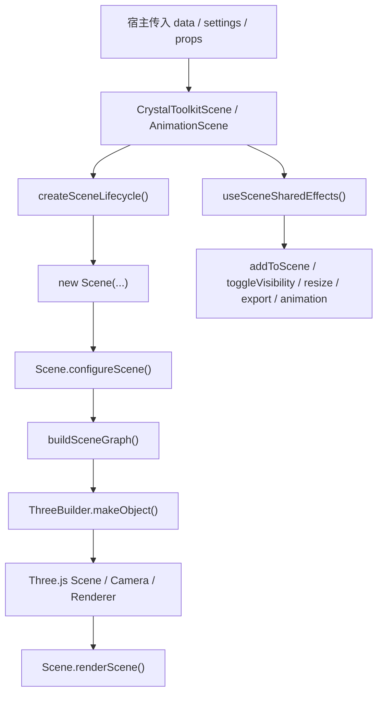

# matsci-crystal-viewer-kit

`@gnosys/matsci-crystal-viewer-kit` 是一个面向材料结构展示场景的 React + Three.js 组件包，提供完整的晶体结构 3D viewer 运行时、工具栏、设置面板挂载位、图例挂载位、截图与模型导出能力。

## GitHub Overview

`matsci-crystal-viewer-kit` is a reusable crystal structure viewer toolkit for materials applications. It focuses on a production-oriented 3D viewer shell built with React and Three.js, including scene rendering, interaction, export, and host-side customization hooks.

If this project is useful to you, welcome to star the repository and open pull requests. Contributions for bug fixes, documentation improvements, and especially internationalization support are welcome.

## Package Availability

This package is published to our team's private npm registry for internal projects. The current published version is `0.1.6`.

Typical package installation flow:

```bash
pnpm add @gnosys/matsci-crystal-viewer-kit@0.1.6 --save-exact
```

它不是一个“页面级应用组件集合”，而是一个专注于晶体结构可视化的底层能力包。你可以把它理解为：

- 一个以 `Scene JSON` 为输入的数据驱动 3D 渲染运行时
- 一个可独立发布、可复用、可被宿主产品接入的晶体结构 viewer shell
- 一个已经完成过一轮生命周期、性能和展示优化收敛的工程化组件库

如果你只是想快速接入，直接看“快速开始”和“常用 Props”。  
如果你要维护或扩展，建议从“设计目标”“架构概览”“高性能设计”开始。

## 目录

1. [项目定位](#项目定位)
2. [核心特性](#核心特性)
3. [为什么这个包值得单独存在](#为什么这个包值得单独存在)
4. [安装](#安装)
5. [对外导出](#对外导出)
6. [快速开始](#快速开始)
7. [常用 Props](#常用-props)
8. [Scene JSON 输入模型](#scene-json-输入模型)
9. [组件与架构概览](#组件与架构概览)
10. [核心运行链路](#核心运行链路)
11. [高性能设计与已实现优化](#高性能设计与已实现优化)
12. [交互与展示能力](#交互与展示能力)
13. [样式系统与宿主覆盖](#样式系统与宿主覆盖)
14. [导出能力](#导出能力)
15. [宿主集成建议](#宿主集成建议)
16. [开发命令](#开发命令)
17. [发布](#发布)
18. [创新点与性能基准](#创新点与性能基准)


## 项目定位

`matsci-crystal-viewer-kit` 从 `matsci-ui（mp-react-components）` 中抽离出来，目标非常明确：

- 接收宿主传入的 `Scene JSON`
- 在 React 中创建和维护一个可交互的 Three.js 场景
- 提供产品可用的 viewer 外壳，而不只是裸画布
- 允许宿主通过 props、children、文案和样式覆盖进行业务定制

它负责：

- 原子、键、晶胞、箭头、多面体、表面、标签等 3D 对象的统一渲染
- 旋转、缩放、点击选择、选中高亮、视角复位等 viewer 行为
- 工具栏、全屏、截图、导出、设置面板、图例挂载位
- 普通结构场景、通用动画场景、声子动画场景三类主路径

它不负责：

- 材料搜索页面本身
- 周期表与检索 UI
- 后端请求和数据缓存
- 将 CIF / 结构对象转成 Scene JSON 的上游业务逻辑

换句话说，这个包的职责是“晶体结构 viewer runtime + viewer shell”，而不是“完整材料平台前端”。

## 核心特性

当前版本已经具备一套完整、可交付的晶体结构查看器能力：

- 支持数据驱动渲染，输入是易于后端生成和传输的 `Scene JSON`
- 支持多种结构对象类型，包括 `spheres`、`cylinders`、`lines`、`arrows`、`convex`、`surface`、`labels`、`ellipsoids`、`bezier`
- 支持普通静态场景、滑杆动画场景、播放动画场景和声子振动动画场景
- 支持对象点击、单选/多选、outline 高亮、tooltip、inset 二级视图联动
- 支持截图导出、场景导出、宿主自定义导出菜单项
- 支持 settings panel 与 legend panel 作为宿主可插拔区域
- 支持本地 CSS 样式体系，不依赖 Less
- 支持在宿主中以 npm 包形式长期维护和升级

## 为什么这个包值得单独存在

这个包之所以值得被独立抽出来，不是因为“能画一个 3D 场景”，而是因为它已经具备了几个工程上很关键的特征：

- 生命周期完整：初始化、挂载、尺寸同步、销毁、全屏切换、动画切换都已收口
- 性能路径清晰：全屏不重建 Scene、ResizeObserver 统一尺寸同步、outline 改为 dirty-driven、viewport 配置不再每帧重复
- 模块边界清楚：交互、命中测试、选择、高亮、相机 framing、controls 已经拆成独立子模块
- 宿主友好：样式可覆盖、文案可覆盖、children 可挂载、导出链路可透传

这意味着它不再只是“某个页面里长出来的 3D 组件”，而是一个可以在多个宿主项目中复用的结构展示基础设施。

## 安装

如果你已经接入团队内部私有 registry，可以按下面的包名安装。  
如果没有接入，需要先在本地自行打包后再使用。

```bash
pnpm add @gnosys/matsci-crystal-viewer-kit
```

当前 `peerDependencies`：

- `react >=18 <20`
- `react-dom >=18 <20`
- `three ^0.163.0`

这意味着宿主项目需要自己提供 `react`、`react-dom` 和 `three`。  
这样做的好处是避免多份 `three` 运行时并存，减少实例不一致和 bundle 膨胀问题。

样式引入方式：

```ts
import '@gnosys/matsci-crystal-viewer-kit/style.css';
```

## 对外导出

根入口 [src/index.ts](./src/index.ts) 当前导出：

- `CameraContextProvider`
- `CrystalToolkitAnimationScene`
- `CrystalToolkitScene`
- `Download`
- `PhononAnimationScene`
- `Scene`

最常用的是：

- `CrystalToolkitScene`
- `CrystalToolkitAnimationScene`
- `PhononAnimationScene`

`Scene` 是底层运行时类，通常只在更底层定制时才会直接使用。

## 快速开始

```tsx
import {
  CameraContextProvider,
  CrystalToolkitScene,
} from '@gnosys/matsci-crystal-viewer-kit';
import '@gnosys/matsci-crystal-viewer-kit/style.css';

type ViewerProps = {
  sceneJson: any;
};

export function StructureViewer({ sceneJson }: ViewerProps) {
  return (
    <CameraContextProvider>
      <CrystalToolkitScene
        data={sceneJson}
        sceneSize={480}
        settings={{
          renderer: 'webgl',
          background: '#ffffff',
          staticScene: true,
          antialias: true,
          defaultZoom: 1,
          secondaryObjectView: true,
        }}
        toggleVisibility={{}}
        showControls
        showExpandButton
        showImageButton
        showExportButton
        showPositionButton
      />
    </CameraContextProvider>
  );
}
```

如果不需要多个 viewer 共享相机状态，也可以不包 `CameraContextProvider`，组件内部会退回到自己的 reducer。

## 常用 Props

以 [CrystalToolkitScene.tsx](./src/components/crystal-toolkit/CrystalToolkitScene/CrystalToolkitScene.tsx) 为例，最常用的 props 如下：

### 基础渲染

- `data`
  当前要渲染的 `Scene JSON`，这是最核心的输入。

- `settings`
  场景运行配置。常用项包括：
  - `renderer: 'webgl' | 'svg'`
  - `background`
  - `transparentBackground`
  - `antialias`
  - `staticScene`
  - `defaultZoom`
  - `zoomToFit2D`
  - `extractAxis`
  - `sphereSegments`
  - `cylinderSegments`

- `sceneSize`
  viewer 画布尺寸，支持数字或字符串。

- `toggleVisibility`
  通过对象组名控制显隐，通常用于按元素组、晶胞、键、多面体等开关显示。

### 交互与视图

- `showControls`
  是否显示工具栏，默认一般开启。

- `showExpandButton`
  是否显示全屏按钮。

- `showImageButton`
  是否显示截图导出按钮。

- `showExportButton`
  是否显示模型导出按钮。

- `showPositionButton`
  是否显示“恢复初始视角”按钮。

- `animation`
  动画模式，常见值有：
  - `play`
  - `none`
  - `slider`

### 导出与事件

- `imageRequest`
  用于从外部触发截图或场景导出。

- `imageType`
  导出图片类型。

- `fileOptions`
  控制导出菜单项列表。

- `onObjectClicked`
  对象点击回调。

### 面板与文本

- `children`
  第一个 child 进入 settings panel，第二个 child 进入底部 legend panel。

- `texts`
  覆盖工具栏 tooltip 和导出菜单文案。

- `className`
  viewer 根节点 className。

## Scene JSON 输入模型

这个包的设计核心是：Three.js 场景不是由宿主手写 mesh，而是由宿主或后端传入 `Scene JSON`。

这套设计的价值有三点：

- 后端或 Python 端更容易生成
- 数据和渲染职责解耦
- 更容易做跨项目接入与协议演进

从代码看，类型收敛在 [scene-types.ts](./src/components/crystal-toolkit/scene/scene-types.ts)。

典型对象类型包括：

- `spheres`
  原子球，最常见的节点类型

- `cylinders`
  键、连接杆

- `lines`
  晶胞线框

- `arrows`
  坐标轴、向量

- `convex`
  配位多面体

- `surface`
  表面对象

- `ellipsoids`
  椭球

- `bezier`
  曲线

- `labels`
  标签与文本

建议把 Scene JSON 视为一层稳定协议，而不是在宿主里直接混写 Three.js 对象创建逻辑。

## 组件与架构概览

核心目录位于：

[src/components/crystal-toolkit](./src/components/crystal-toolkit)

可以按职责分成五层。

### 1. React 组件层

主要文件：

- [CrystalToolkitScene.tsx](./src/components/crystal-toolkit/CrystalToolkitScene/CrystalToolkitScene.tsx)
- [CrystalToolkitAnimationScene.tsx](./src/components/crystal-toolkit/CrystalToolkitAnimationScene/CrystalToolkitAnimationScene.tsx)
- [PhononAnimationScene.tsx](./src/components/crystal-toolkit/PhononAnimationScene/PhononAnimationScene.tsx)
- [SceneToolbar.tsx](./src/components/crystal-toolkit/SceneToolbar.tsx)

职责：

- viewer 布局壳层
- mount node 管理
- 工具栏按钮和面板挂载
- React props 到 Scene runtime 的桥接

### 2. 共享 glue 层

主要文件：

- [sceneComponentShared.ts](./src/components/crystal-toolkit/sceneComponentShared.ts)
- [sceneComponentUtils.ts](./src/components/crystal-toolkit/sceneComponentUtils.ts)
- [sceneExport.ts](./src/components/crystal-toolkit/sceneExport.ts)

职责：

- `Scene` 实例创建与销毁
- shared effects 收口
- camera 状态同步
- 导出行为触发

### 3. Scene runtime 层

核心文件：

- [Scene.ts](./src/components/crystal-toolkit/scene/Scene.ts)

职责：

- renderer、camera、scene、labelRenderer 生命周期管理
- controls、outline、tooltip、inset 协同
- add / render / resize / destroy 主路径
- 交互、命中测试、选择、高亮、动画编排

### 4. Scene 子模块层

主要文件：

- [scene-controls.ts](./src/components/crystal-toolkit/scene/scene-controls.ts)
- [scene-camera.ts](./src/components/crystal-toolkit/scene/scene-camera.ts)
- [scene-graph.ts](./src/components/crystal-toolkit/scene/scene-graph.ts)
- [scene-hit-test.ts](./src/components/crystal-toolkit/scene/scene-hit-test.ts)
- [scene-interaction.ts](./src/components/crystal-toolkit/scene/scene-interaction.ts)
- [scene-object-registry.ts](./src/components/crystal-toolkit/scene/scene-object-registry.ts)
- [selection-controller.ts](./src/components/crystal-toolkit/scene/selection-controller.ts)
- [tooltip-helper.ts](./src/components/crystal-toolkit/scene/tooltip-helper.ts)
- [inset-helper.ts](./src/components/crystal-toolkit/scene/inset-helper.ts)

职责：

- 降低 `Scene.ts` 的体量与耦合度
- 让命中测试、选择、高亮、相机 framing、控制器等能力可独立维护

### 5. Three 对象构造与动画层

主要文件：

- [three_builder.ts](./src/components/crystal-toolkit/scene/three_builder.ts)
- [animation-helper.ts](./src/components/crystal-toolkit/scene/animation-helper.ts)
- [phonon-animation-helper.ts](./src/components/crystal-toolkit/scene/phonon-animation-helper.ts)
- [RadiusTubeBufferGeometry.ts](./src/components/crystal-toolkit/scene/RadiusTubeBufferGeometry.ts)

职责：

- 将 Scene JSON 转成具体的 Three.js 对象
- 构建 geometry、material、mesh
- 为普通动画和声子动画提供支持

## 核心运行链路



更具体一点：

1. React 组件创建 mount node。
2. `createSceneLifecycle()` 实例化底层 `Scene`。
3. `Scene` 初始化 renderer、camera、lights、tooltip、controls、outline、inset。
4. `data` 变化时，`useSceneSharedEffects()` 触发 `scene.addToScene(...)`。
5. `addToScene()` 内部通过 `buildSceneGraph()` 和 `ThreeBuilder` 构造对象。
6. 可点击对象、tooltip 对象和 outline 对象都会注册到 object registry 中。
7. `renderScene()` 输出主场景、标签层、outline 和 inset。

## 高性能设计与已实现优化

这一节只写已经进入主路径的优化，不把规划项写成既成事实。

### 1. 全屏切换不再销毁并重建 Scene

早期常见问题是全屏切换引发 Scene、renderer、controls、订阅和事件监听全部重建，进而造成闪烁、状态丢失和额外初始化开销。

当前实现已经改成：

- 保留底层 `Scene` 实例
- 容器变化后通过 `attachToMountNode()` 重新绑定 DOM
- 调用 `resizeRendererToDisplaySize()`
- 调用 `renderScene()` 做稳定重绘

这使全屏切换从“重建运行时”变成“重绑与重绘”，明显降低了抖动和闪烁。

### 2. Resize 行为统一收敛到 `ResizeObserver`

在 React 组件层，`useResizeObserver` 监听 mount node 尺寸变化，并统一转发给：

- `scene.current.resizeRendererToDisplaySize()`

而 `Scene.resizeRendererToDisplaySize()` 内部负责：

- renderer 尺寸同步
- label renderer 尺寸同步
- viewport / scissor 重设
- 必要时触发重绘

这样可以避免多个 resize 入口互相打架，减少“容器变了但 3D 没跟着变”的问题。

### 3. 主 viewport 状态不再每帧重复设置

`Scene.ts` 中已经引入：

- `mainViewportConfigured`
- `syncMainViewport()`

主 viewport 的 `setSize`、`setViewport`、`setScissor` 不再放在每帧渲染路径里，而是收敛到：

- 初始化阶段
- `attachToMountNode()`
- `resizeRendererToDisplaySize()`
- inset 渲染后的主 viewport 恢复

这降低了 WebGL 每帧固定开销，尤其有利于后续多 viewport 或 multi-pass 继续演化。

### 4. Outline 高亮改为 dirty-driven 更新

`Scene.ts` 当前使用：

- `outlineDirty`
- `refreshOutlineIfNeeded()`

只有在下列情况下才真正刷新 outline：

- selection 改变
- 场景数据替换
- `toggleVisibility()` 导致选中对象不可见
- 需要恢复旧 selection

这让 outline 从“帧驱动”变成“状态驱动”，静态场景下可以减少大量无意义的重建。

### 5. `toggleVisibility` 与 selection 清理联动

对象隐藏后，如果 selection 还残留，会造成：

- outline 残留
- inset 与主场景状态不一致
- 逻辑状态和可视状态脱节

当前 `toggleVisibility()` 已经联动：

- `selectionController.removeInvisibleSelections(...)`
- `outlineDirty = true`
- `renderScene()`

这样显隐切换后，选择态和显示态始终一致。

### 6. Scene 运行时职责已经做过一轮模块化拆分

这不是“微观帧优化”，但它是后续持续优化能成立的前提。

当前已经把以下能力从 `Scene.ts` 中拆出：

- 命中测试
- 交互桥接
- 对象注册
- selection 与 outline
- controls
- camera framing
- tooltip
- inset

收益是：

- 降低单文件复杂度
- 更容易定位性能热点
- 更容易替换某一块实现而不伤到全局

### 7. 类型与示例数据解耦

`SceneJsonObject` 等类型已经收敛到：

- [scene-types.ts](./src/components/crystal-toolkit/scene/scene-types.ts)

示例数据迁移到：

- [fixtures](./src/components/crystal-toolkit/fixtures)

这样运行时代码不再依赖大 fixture 文件，打包边界更干净，也为后续 tree shaking 和 bundle 分析提供了更清晰的结构。

## 创新点与性能基准

本节只记录已经进入当前主路径的实现和本次最新自动基准结果。性能数据来自当前机器、当前浏览器和固定测试参数，不应直接外推为所有设备的固定性能承诺。

### 创新点

1. **交互实例化渲染**：统一球体对象中的原子优先使用 `InstancedMesh`；raycast 通过 `instanceId` 映射到原子数据，因此批量渲染不会牺牲点击和 tooltip 的单原子精度。
2. **实例级悬浮高亮**：通过 `instanceColor` 只修改当前命中的原子，移出时恢复该实例颜色，不会造成整组原子同时变色，也不需要为每个原子复制材质。
3. **单帧单次 hover 拾取**：连续 `mousemove` 事件通过 `requestAnimationFrame` 合并，同一帧只保留最新坐标并执行一次 raycast，同时复用结果处理 tooltip、cursor 和重绘。
4. **共享资源与生命周期分离**：区分场景对象资源和 builder 共享缓存，场景替换释放非共享资源，viewer 销毁时统一释放缓存，避免重复替换导致几何体计数持续增长。
5. **高频路径低分配**：复用 raycast 的屏幕向量、指针向量和高亮颜色对象，减少鼠标移动过程中的临时 Three.js 对象和 GC 压力。
6. **更新边界控制**：对象可见性通过索引增量更新，resize 和指针事件通过 rAF 收敛，React 回调使用稳定引用，减少无关 props 变化造成的完整场景重建。

### 参考实现与当前实现对照总表

参考对象为 `matsci-ui` 中的 MP 衍生晶体预览实现。下表只说明本组件库实际新增或收敛的工程能力；没有把参考组件已经具备的晶体结构表达、Three.js 基础渲染和交互能力重复包装成创新。

| 能力维度 | 参考实现的基础形态 | 本组件库的实现与收益 | 展示/行为兼容性 |
| --- | --- | --- | --- |
| 组件边界 | 预览能力与业务页面组织在一起 | 抽取为独立 React 组件、场景管理器和配置入口，可被材料库、详情页、对话和工作流复用 | 保留原有 scene JSON 展示模型 |
| 场景更新 | 数据、回调和展示设置容易共同进入更新路径 | 拆分场景拓扑、对象索引、可见性、回调和展示参数；只有影响拓扑或几何的变化才重建 | 结构内容、主题、相机和控制项不变 |
| 大规模原子 | 批量原子可能按普通 Mesh 展开 | 同形状静态球体批量使用一个 `InstancedMesh`，复用 geometry/material；当前基准 1,000/5,000/10,000 原子均为 1 draw call、1 geometry | 位置、半径、颜色、光照和结构布局不变 |
| 逐原子交互 | 批处理后容易丢失原子级命中上下文 | 通过 `intersection.instanceId` 建立实例索引到 JSON 对象的映射 | 点击、tooltip、cursor 和单原子选择保持可用 |
| hover 高亮 | 可能修改整批对象或复制材质 | 使用 `instanceColor` 只更新当前实例，并保存/恢复实例基础颜色 | 不再出现整组原子被变色，视觉语义更精确 |
| 高频指针 | burst `mousemove` 可能重复 raycast 和状态处理 | 使用 rAF 保留最新指针位置，同一帧最多一次 hover raycast；本次 240 事件观测到 1 次实际拾取 | 不改变最终指针位置和命中结果 |
| 高频临时对象 | 命中测试过程可能反复创建向量 | 复用 `Vector2` 等 scratch 对象，降低分配和 GC 压力 | 命中坐标、tooltip 位置和相交判断不变 |
| 几何/材质资源 | 场景替换和共享缓存的所有权边界不够清晰 | 场景资源、共享 builder 缓存和 viewer 销毁分别管理；替换释放非共享资源，最终销毁释放缓存 | 保留结构切换、动画和导出能力 |
| 生命周期验证 | 仅靠页面观感难以发现资源累积 | 增加 30 轮 × 30 次替换的自动观测，并记录 geometry、texture 和三段 JS Heap | 不影响运行时展示 |
| resize | 多入口 resize 可能在同一帧重复执行 | ResizeObserver、窗口变化和容器变化统一到 rAF，同一帧最多一次真实 resize | 保留自适应尺寸、比例和 viewport |
| 高 DPI | 设备 DPR 可能直接放大画布成本 | 提供 `maxPixelRatio`，由应用按场景配置 DPR 上限 | 通过配置在清晰度和 GPU 压力间取平衡 |
| 标签与 DOM | 大量 CSS2D 标签会增加布局和内存压力 | `maxLabelCount` 控制标签预算，默认限制显式标签数量 | 标签功能保留，密集结构按预算展示 |
| 全屏/放大 | 全屏切换可能重建 Scene | 保留 Scene，改为重绑挂载节点、同步尺寸并重绘 | 视角和结构状态不因放大切换丢失 |
| 轮廓高亮 | 可能每帧刷新 outline | 使用 dirty-driven 更新，只在 selection/可见性/场景变化时刷新 | 选中轮廓视觉效果保留 |
| React 集成 | 三维异常容易影响外围页面 | 应用侧使用 lazy、Suspense、局部 ErrorBoundary 和查询缓存 | 三维失败时其他业务区域可继续工作 |
| 性能证据 | 缺少统一可导出的重复测试协议 | Storybook 提供 30 轮自动基准、JSON/Markdown 导出和固定采样参数 | 不改变业务 API |

#### 渲染、资源与图形管线增量

| 能力维度 | 旧实现的处理方式 | 新实现的处理方式 | 直接优势 | 量化/验证状态 |
| --- | --- | --- | --- | --- |
| 球体几何缓存 | `getSphereGeometry()` 每次生成新几何体，场景内重复参数不能跨对象复用 | 按半径、球面起止角和分段数建立缓存键，缓存 geometry 并标记共享所有权 | 降低重复几何构建和 GPU geometry 数量 | 新版 1,000/5,000/10,000 静态原子均为 1 geometry；旧版同协议待补测 |
| 圆柱/箭头/立方体缓存 | 圆柱、箭头头部和立方体几何体缺少集中缓存 | 分别使用 cylinder/head/cube cache，按真实几何参数复用 | 键、箭头和立方体密集场景减少构建分配 | 源码已确认；旧版量化待补测 |
| 材质缓存 | `makeMaterial()` 每次直接创建材质 | 按 renderer、材质类型、参数、颜色和透明度建立缓存；需要独立变体时 clone | 共享材质与变体材质边界清晰，减少材质对象数量 | 源码已确认；旧版量化待补测 |
| 静态原子批处理 | 每个位置创建一个普通 Mesh | 满足静态、同形状且无 hoverLabel 条件时使用 InstancedMesh；复杂对象安全回退 | 大规模原子由逐对象提交变为实例批次 | 新版当前基准 1 个 draw call；旧版逐 Mesh 数待补测 |
| 实例颜色 | 普通 Mesh 直接改材质，批处理后没有单实例颜色路径 | 使用 `instanceColor` 保存基础颜色并更新单个 instance | 保留单原子颜色和 hover 语义，避免整批变色/材质复制 | 交互功能回归已覆盖；FPS/内存百分比待 A/B |
| 键/线定位计算 | 每个位置对重复向量、方向和四元数的创建分散在构建路径 | 统一 `getSegmentPlacement()` 返回 midpoint、direction、quaternion、length、end | 减少重复几何定位逻辑，更新和初次构建共用同一规则 | 源码已确认；旧版量化待补测 |
| 虚线 | 创建 LineDashedMaterial 后没有统一的样式解析边界 | 统一颜色、宽度、scale、dashSize、gapSize，并在需要时调用 `computeLineDistances()` | 虚线视觉正确，更新时不必走完整场景重建 | 展示回归已覆盖；耗时待补测 |
| 透明表面 | 透明属性散落在 surface/convex 构建路径 | 统一设置 `transparent` 和 `depthWrite=false` | 降低透明面深度遮挡造成的错误重绘，保持表面叠加效果 | 展示回归已覆盖；GPU 指标待补测 |
| 参数更新 | 半径、边缘或线材质更新可能直接替换而不统一处理旧资源 | 统一 geometry replacement 和 material dispose，跳过共享资源释放 | 防止参数拖动造成旧几何/材质残留 | 场景替换资源计数稳定；旧版同协议待补测 |
| DPR | 直接使用设备 DPR，4K/高密度屏幕会线性放大 framebuffer | `maxPixelRatio` 默认上限 2，宿主可配置 | 控制 GPU 像素填充成本，同时保留清晰度调节 | 当前基准 DPR=1；不同 DPR 对照待补测 |
| CSS2D 标签 | 标签数量完全由输入决定 | `maxLabelCount` 默认 250，0 可关闭 | 限制 DOM、布局和文本节点内存预算 | 配置/功能已确认；标签密集 A/B 待补测 |

#### 更新、交互与生命周期增量

| 能力维度 | 旧实现的处理方式 | 新实现的处理方式 | 直接优势 | 量化/验证状态 |
| --- | --- | --- | --- | --- |
| hover 事件 | `mousemove` 直接执行 raycast、tooltip 和重绘 | 最新坐标写入 ref，rAF 每帧最多一次拾取 | 事件 burst 不再按事件数放大 CPU 工作 | 新版 240 事件实际拾取中位数 1；旧版待同协议补测 |
| 命中临时对象 | Scene 命中路径内分散创建屏幕/指针向量 | `scene-hit-test` 复用 Vector2 scratch 对象 | 降低高频分配和 GC 抖动 | 源码已确认；分配量待 profiler A/B |
| 交互候选集合 | clickable 和 tooltip 路径分别命中，容易重复拾取 | registry 同时维护 clickable、tooltip 和去重后的 interactive 集合 | 一次 raycast 结果同时服务 tooltip、cursor 和交互判断 | 新版 240 事件 1 次拾取；旧版待补测 |
| 对象查找 | 可见性操作依赖完整场景树查找 | `objectNameIndex` Map 建立名称到 Object3D 的索引 | 显示开关从遍历转为索引访问 | 功能回归已确认；切换耗时待补测 |
| selection 与 visibility | 隐藏对象可能保留 selection/outline | 隐藏后调用 `removeInvisibleSelections()` 并标记 outline dirty | selection、outline、inset 与可见状态一致 | 功能回归已确认 |
| outline | 选择后刷新路径较频繁 | `outlineDirty` 只在 selection、场景替换和可见性变化时刷新 | 静态场景减少后处理构造和重复绘制 | 当前静态基准帧间隔见报告；旧版待补测 |
| resize | window resize 和容器 resize 都可能立即执行真实 resize | ResizeObserver/window/挂载变化统一进 rAF，pending frame 可取消 | 连续尺寸变化每帧最多一次真实 resize | 代码路径已确认；次数 A/B 待补测 |
| viewport/scissor | inset 绘制后的 WebGL 状态恢复边界分散 | 主 viewport/scissor 有缓存状态，inset 后显式恢复 | 避免辅助视图影响主视图后续绘制 | 多视图功能回归已确认 |
| 全屏/放大 | 放大路径容易重新初始化 viewer | `attachToMountNode()` 只重挂载 canvas/CSS2D，保留 Scene、renderer、controls | 减少重建、闪烁、状态丢失和资源瞬时峰值 | 功能回归已确认；重建次数 A/B 待补测 |
| 相机同步 | controls 的每次 change 更容易立即触发 React dispatch | ref 保存瞬时值，50ms 窗口合并不可见的中间状态 | 降低 React 全局状态更新和父树重渲染 | 交互回归已确认；dispatch 次数 A/B 待补测 |
| 生命周期销毁 | 逻辑集中，pending 事件/动画/DOM/renderer 释放边界较粗 | 统一取消 rAF/timer、移除监听、销毁 controls/inset/debug、释放场景和 renderer | 降低路由切换、反复打开和场景替换的残留风险 | 900 次替换 geometry 峰值/最终值 1/1；旧版待同协议补测 |
| 共享资源所有权 | 场景资源与可复用资源可能混用 | `markSharedThreeResource`/`isSharedThreeResource` 区分所有权 | 避免共享资源被提前 dispose，也避免最终销毁漏释放 | 源码已确认；正式 heap snapshot 待补测 |

#### 架构、展示与交付增量

| 能力维度 | 旧实现的处理方式 | 新实现的处理方式 | 直接优势 | 量化/验证状态 |
| --- | --- | --- | --- | --- |
| Scene 结构 | Scene.ts 和多个 React scene 组件各自包含大量生命周期、交互和导出逻辑 | 拆分 camera、controls、graph、registry、hit-test、interaction、selection、tooltip、export | 单一热点可独立优化，减少重复逻辑和回归面 | 源码/模块边界已确认；不直接等同于运行时加速 |
| React 生命周期 | 静态、动画、声子组件重复维护初始化、resize、camera sync | `createSceneLifecycle()`、`useSceneSharedEffects()`、`useSceneCameraSync()` 共享路径 | 统一销毁和更新语义，减少三份实现漂移 | 三类组件 typecheck/test 已通过 |
| 回调稳定性 | props callback 变化可能影响 effect 依赖和重建 | `onObjectClickedRef` 持有最新回调，不作为初始化 effect 的重建条件 | 业务回调更新不重建 WebGL runtime | 源码已确认 |
| 动画回退 | 所有对象难以同时满足实例化和逐对象动画 | 静态可批处理，animate/hoverLabel/异构对象走普通 Mesh | 在保留动画、标签和复杂语义的前提下使用优化路径 | 动画功能回归已确认 |
| 导出 | PNG/GLTF/GLB/USDZ 逻辑分散在各 React 组件 | `sceneExport` 统一文件命名、导出分发和宿主 setProps | 导出行为一致，底层 runtime 与 UI 解耦 | 导出回归已覆盖 |
| 场景/fixture 边界 | 示例 scene 数据与运行时代码边界较近 | scene types、demo fixtures 和运行时模块分离 | 更清晰的 tree-shaking、打包和维护边界 | 构建产物已验证 |
| 包交付 | 应用源码和组件能力混合消费 | `exports` 明确入口、style.css、peerDependencies 和独立 dist | 避免重复 React/Three，便于版本化消费和升级 | npm 0.1.6 发布并被宿主安装 |
| 性能证据 | 主要靠人工观感和单次测量 | Storybook 多场景 30 轮、CLI 自动落 JSON/Markdown 并同步文档 | 每次优化可重复、可审计、可回归 | 当前报告 30 轮完成 |

其中“源码/功能差异已确认”说明新实现确实存在对应代码路径；“百分比待 A/B”表示尚未在相同机器和协议下运行旧实现，不能据此写成性能提升比例。当前新实现的实际数据见下方自动报告。

### 已实现优化方案

| 优化方向 | 当前实现 | 不改变的展示/交互能力 |
| --- | --- | --- |
| 重复原子渲染 | 同形状球体使用 `InstancedMesh` 和共享 geometry/material | 原子位置、半径、颜色和光照效果 |
| 交互批处理 | `intersection.instanceId` 映射原子索引 | 点击、tooltip、cursor 和单原子高亮 |
| 材质内存 | 实例颜色替代逐原子材质克隆 | 元素颜色和悬浮反馈 |
| 高频输入 | rAF 合帧、单帧单次 raycast | 指针响应和命中精度 |
| 命中测试 | 复用 `Vector2`，减少临时对象 | 命中坐标和 tooltip 定位 |
| 场景替换 | 递归释放非共享 geometry/material/texture | 结构切换和相机行为 |
| 画布 resize | ResizeObserver + rAF 合并 | 尺寸自适应和视口比例 |
| 高分辨率 | `maxPixelRatio` 限制 | 视觉清晰度与可配置 DPR |
| 复杂对象兼容 | 动画、hoverLabel、异构语义回退普通 Mesh | 原有复杂场景行为 |
| 图元资源复用 | sphere/cylinder/head/cube geometry cache 与 material cache | 降低重复构建和 GPU 资源数量 |
| 复杂图元正确性 | 虚线距离、透明深度写入、surface normals、convex edge 独立处理 | 保留复杂结构的视觉正确性 |
| 更新资源安全 | geometry/material 替换前按共享标记释放旧资源 | 降低半径、线型和多面体更新造成的残留 |
| 对象索引 | object name Map + clickable/tooltip/interactive registry | 可见性切换和拾取减少全场景遍历 |
| 辅助视图状态 | 主 viewport/scissor 缓存并在 inset 后恢复 | 轴视图不污染主视图渲染状态 |
| 相机和回调 | camera change 50ms 合并、最新回调 ref | 降低父级 React 更新，不丢最终视角 |
| 全屏 runtime | attachToMountNode 重挂载而非重建 | 保留视角和资源，减少放大闪烁 |
| 结构化导出 | sceneExport 统一 PNG/GLTF/GLB/USDZ 和命名 | 保持导出能力，减少组件重复代码 |

### 多轮性能基准测试

基准入口是 Storybook 的 `Many Round Protocol`。运行一次会自动执行：

- 1,000、5,000、10,000 原子静态场景；
- 1,000 原子 clickable + tooltip 交互场景；
- 240 次连续 `mousemove` 的 hover 压测；
- 30 轮、每轮 30 次同名场景替换的生命周期测试；
- 构建耗时、帧间隔中位数/P95/P99、draw calls、geometry、texture、三角形和 JS Heap 快照。

测试协议固定为每轮 5 帧预热、8 个双帧间隔样本，销毁后额外读取即时值、3 秒值、6 秒值和压力缓冲释放稳定值；所有结果自动计算平均值、中位数、P95、P99、标准差、最小值和最大值。页面支持导出原始 JSON 和 Markdown，命令行也可以自动运行并落盘：`pnpm benchmark:many-round`。结果写入 `benchmark-results/latest.json` 和 `benchmark-results/latest.md`，并同步更新本 README 与组件库内的技术说明。

<!-- BENCHMARK_RESULTS_START -->
### 最新 30 轮性能结果（新实现）

本表为当前组件库在本机、Headless Chrome、固定 scene JSON 和当前采样协议下的实测结果，格式为“30 轮中位数 / P95”。旧实现尚未使用相同协议复测，因此不能从本表直接推导旧版百分比。

#### 旧实现与新实现的实测对照

| 场景 | 旧实现构建耗时 | 新实现构建耗时 | 旧实现 draw calls/geometry | 新实现 draw calls/geometry | 结论 |
| --- | ---: | ---: | ---: | ---: | --- |
| 1,000 原子静态 | 待同协议补测 | 22.60 / 53.40 ms | 待同协议补测 | 1.00 / 1.00 | 新实现已确认走实例批处理；性能百分比待 A/B |
| 5,000 原子静态 | 待同协议补测 | 21.50 / 34.50 ms | 待同协议补测 | 1.00 / 1.00 | 新实现保持单实例批次；性能百分比待 A/B |
| 10,000 原子静态 | 待同协议补测 | 24.60 / 72.30 ms | 待同协议补测 | 1.00 / 1.00 | 原子数量增长不增加球体批次；性能百分比待 A/B |
| 1,000 原子交互 | 待同协议补测 | 31.40 / 57.20 ms | 待同协议补测 | 1.00 / 1.00 | 240 次指针事件合并为 1.00 次 hover raycast |

| 场景 | 构建耗时 | 帧间隔中位数 | 帧间隔 P95 | draw calls | geometry |
| --- | ---: | ---: | ---: | ---: | ---: |
| 1,000 原子静态 | 22.60 / 53.40 | 8.25 / 8.35 | 8.60 / 8.80 | 1.00 | 1.00 |
| 5,000 原子静态 | 21.50 / 34.50 | 8.30 / 8.35 | 8.70 / 8.80 | 1.00 | 1.00 |
| 10,000 原子静态 | 24.60 / 72.30 | 8.30 / 8.35 | 8.70 / 8.75 | 1.00 | 1.00 |
| 1,000 原子交互 | 31.40 / 57.20 | 8.25 / 8.35 | 8.70 / 8.80 | 1.00 | 1.00 |

240 个连续指针事件在本次基准中合并为 1.00 次实际 hover raycast。该结果反映当前合帧协议，不代表所有设备和所有输入序列都固定为该数值。

### 最新 JS Heap 与生命周期资源结果

浏览器 `performance.memory.usedJSHeapSize` 只是 JS Heap 快照，单位为 MiB；它不是系统 RAM，也不是 GPU VRAM。当前协议包含销毁后一帧、3 秒、6 秒和压力缓冲释放稳定值，并计算 6 秒相对构建差值。稳定值是观察延迟 GC 的证据，不是强制 GC 或正式 Heap Snapshot。

| 场景 | 构建后 | 销毁后一帧 | 销毁 3 秒后 | 销毁 6 秒后 | 压力释放稳定后 | 6 秒相对构建差值 |
| --- | ---: | ---: | ---: | ---: | ---: | ---: |
| 1,000 原子静态 | 78.2 / 79.9 MiB | 55.3 / 63.3 MiB | 55.3 / 63.3 MiB | 55.3 / 63.4 MiB | 78.2 / 79.9 MiB | -22.7 / 0.5 MiB |
| 5,000 原子静态 | 79.3 / 79.3 MiB | 56.9 / 64.9 MiB | 56.9 / 64.9 MiB | 56.9 / 64.9 MiB | 79.3 / 79.3 MiB | -22.6 / -6.7 MiB |
| 10,000 原子静态 | 80.2 / 80.3 MiB | 58.2 / 66.2 MiB | 58.2 / 66.2 MiB | 58.2 / 66.2 MiB | 80.2 / 80.3 MiB | -22.9 / 0.6 MiB |
| 1,000 原子交互 | 78.9 / 79.0 MiB | 56.0 / 63.9 MiB | 56.0 / 63.9 MiB | 56.0 / 64.0 MiB | 78.9 / 78.9 MiB | -15.7 / 0.6 MiB |

生命周期测试为 30 轮 × 30 次同名场景替换，共 900 次替换；geometry 峰值/最终值为 1.00 / 1.00，texture 峰值/最终值为 0.00 / 0.00。6 秒稳定 Heap 首轮/末轮/总差值/每轮斜率为 52.1 / 52.7 / 0.6 / 0.0 MiB。该结果支持“Three.js 可观测资源计数没有随替换线性增长”，但 JS Heap 仍需结合正式 Heap Snapshot 判断具体对象是否可回收。

<!-- BENCHMARK_RESULTS_END -->

## 交互与展示能力

### 工具栏能力

当前工具栏主路径支持：

- 全屏
- 截图
- 模型导出
- 视角复位
- 设置面板开合

核心实现位于：

- [SceneToolbar.tsx](./src/components/crystal-toolkit/SceneToolbar.tsx)

### 选择与高亮

点击对象后，viewer 会：

- 命中测试识别对象
- 将对象与其 JSON 引用映射起来
- 更新 selection controller
- 重建或跳过 outline
- 必要时更新 inset 二级视图

这套链路比“直接点 mesh 改材质”更稳定，也更适合后续扩展。

### 动画能力

除了静态结构场景外，当前还提供：

- `CrystalToolkitAnimationScene`
- `PhononAnimationScene`

支持：

- `play`
- `none`
- `slider`

以及声子相关的 amplitude、phase、eigenvector、velocity 驱动。

### 导出能力

当前 viewer 能力包括：

- PNG 截图导出
- JSON 导出
- 通过 scene export 链路触发 GLTF / GLB / USDZ 等模型导出
- 宿主侧自定义导出菜单项

## 样式系统与宿主覆盖

样式入口：

```ts
import '@gnosys/matsci-crystal-viewer-kit/style.css';
```

这个包的样式是 package-local 的，目标不是替换宿主全局样式，而是为 viewer 提供一套稳定可覆盖的局部视觉系统。

常用覆盖锚点：

- `.mcv-theme`
- `.mcv-root`
- `data-slot="viewer-shell"`
- `data-slot="scene-frame"`
- `data-slot="settings-panel"`
- `data-slot="legend-panel"`
- `data-slot="toolbar"`
- `data-slot="menu"`
- `data-slot="tooltip"`
- `data-slot="scrubber"`

宿主覆盖示例：

```css
.mcv-theme {
  --mcv-color-primary: #073179;
  --mcv-border-radius: 8px;
}

.mcv-root [data-slot='settings-panel'] {
  max-width: 360px;
}
```

如果宿主要做产品化包装，建议优先通过 token 和 `data-slot` 做覆盖，而不是直接深层覆写随机 class。

## 导出能力

这个包的导出链路分两层：

### 1. viewer 内部导出能力

由 `sceneExport.ts` 和 `download-event.ts` 驱动，负责：

- 接收导出请求
- 调用 `Scene` 生成目标数据
- 回传到 props 或宿主回调

### 2. 宿主业务导出能力

宿主可以把模型导出、截图导出、JSON 导出继续桥接到自己的业务链路中，例如：

- 上传到服务端
- 走宿主下载菜单
- 与详情页业务导出统一

## 宿主集成建议

### 1. 把 Scene JSON 生成留在宿主或后端

这个包最适合做“viewer runtime”，不适合在包内继续承载业务建模逻辑。  
如果宿主已经有后端 scene builder，优先直接把 Scene JSON 传进来。

### 2. viewer 不是首屏刚需时，建议宿主侧 lazy load

这个包依赖 Three.js，天然不是最轻的组件。  
如果页面首屏不一定马上展示结构，可以在宿主侧对 viewer 做 lazy load。

### 3. 保证 `react` / `react-dom` / `three` 去重

因为这些都是 peer dependencies，宿主在 Vite / Webpack / pnpm workspace 中应尽量保证单实例，避免出现多份 `three` 带来的运行时问题。

### 4. 高密度业务配置放在宿主层

例如：

- bonding mode
- radii mode
- color scheme
- draw repeats
- polyhedra 开关

这些都更适合宿主层决定，再转换成 `settings`、`toggleVisibility` 或 Scene JSON 视觉变换输入。

## 开发命令

常用命令：

- `pnpm typecheck`
- `pnpm test`
- `pnpm build`
- `pnpm storybook`
- `pnpm build-storybook`
- `pnpm release:pack`

当前 scripts 位于 [package.json](./package.json)：

```bash
pnpm typecheck
pnpm test
pnpm build
pnpm storybook
pnpm build-storybook
pnpm release:pack
```

其中：

- `build` 会清理 `dist`、执行 rollup 构建并准备样式产物
- `storybook` 会启动组件独立演示面，适合做截图和回归验证
- `build-storybook` 会产出静态演示站点
- `prepack` 已配置，所以 `npm pack` / `npm publish` 时会自动构建

### Storybook 与真实结构 Demo

仓库内已经提供了最小 Storybook 演示面，包含两类 story：

- 包内 `simple-scene` fixture，用于基础渲染回归
- 真实结构本地 fixture，用于直接提交静态 Scene JSON

默认会导出这些结构 ID：

- `463206`
- `294068`
- `304763`
- `8233`
- `379864`
- `372653`

这些结构当前在 Storybook 中的本地文件位置：

- [src/demo/fixtures](./src/demo/fixtures)

这些 `json` 已经由本地 `material-search` 数据离线生成。Storybook 不会在运行时请求接口，也不会依赖 token、代理或 `structure-service`。

如果后续要替换演示数据，直接覆盖同名 `json` 文件即可。

## 发布

常见发布命令：

```bash
pnpm release:prepare patch
pnpm release:prepare 0.2.0 --notes "Initial @gnosys release"
pnpm release:publish
pnpm release minor --notes-file ./release-notes.md
```

发布脚本会处理：

- 版本号更新
- `CHANGELOG.md` 追加
- 构建与发布前检查
- registry 发布

registry 配置见 [package.json](./package.json)。

## Contributing

欢迎提交 issue 和 PR。

适合直接贡献的方向包括：

- bug 修复
- 文档改进
- 示例补充
- 可访问性与交互细节优化
- 国际化与多语言支持

如果你计划引入较大的行为变更，建议先在 issue 里说明目标、约束和兼容性影响。
