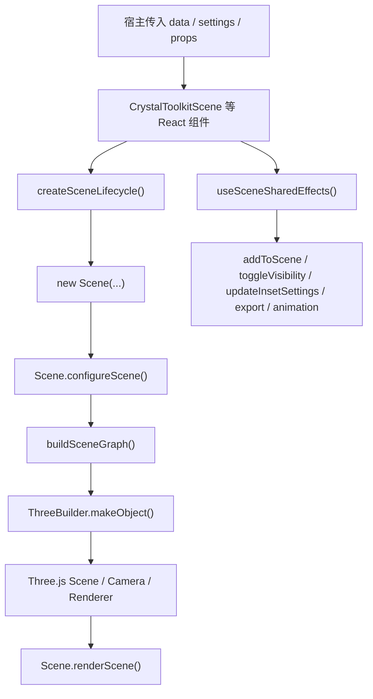

# matsci-crystal-viewer-kit 设计与使用说明

本文档面向 `@gnosys/matsci-crystal-viewer-kit` 的使用者、维护者和二次开发者，系统介绍这个包的设计目标、整体架构、主要功能、对外 API、Scene JSON 数据结构、样式体系以及接入方式。

如果你只是想快速接入，可以先看“快速开始”和“常用 Props”两节；如果你需要继续维护或扩展这个包，建议从“设计目标”“架构概览”“核心运行链路”开始读。

## 1. 包的定位

`@gnosys/matsci-crystal-viewer-kit` 是从 `matsci-ui` 中抽离出来的晶体结构可视化组件包。

它的职责非常明确：

1. 接收宿主传入的 scene JSON 数据。
2. 在 React 中创建和维护一个 Three.js 驱动的 3D 场景。
3. 提供 viewer 常用的交互能力，例如旋转、缩放、选择、全屏、导出、截图、调试视图和动画播放。
4. 提供最小但完整的 UI 外壳，包括工具栏、设置面板挂载位、底部图例挂载位和样式系统。

它不负责的事情也很明确：

1. 不负责材料搜索页面本身。
2. 不负责周期表或搜索 UI。
3. 不负责后端数据查询。
4. 不负责把材料对象转换成 scene JSON，scene JSON 的生产通常由后端、Python 端或宿主项目自身完成。

换句话说，这个包本质上是一个“晶体结构 viewer runtime + viewer shell”。

## 2. 设计目标

这个包当前的设计目标可以概括为五点。

### 2.1 独立可复用

从 `matsci-ui` 中抽离出来后，它应该能作为独立 npm 包被安装和升级，而不是继续和大 UI 包强耦合。

### 2.2 宿主友好

它默认提供开箱即用的 viewer 能力，但同时允许宿主通过 props、children、文案覆盖和 CSS 覆盖完成定制。

### 2.3 以 Scene 为核心

核心运行时围绕 `Scene` 类展开。React 组件层主要负责生命周期、DOM 容器、控制条和 props 到 Scene 的桥接。

### 2.4 内部逐步模块化

早期的实现偏 class-heavy，很多逻辑集中在 `Scene` 和 `ThreeBuilder`。目前已经逐步演进为：

1. `Scene` 负责 orchestration 和生命周期。
2. 交互、命中测试、选择、高亮、控制器、相机 framing 等能力拆到 helper/controller 模块。
3. 构造 Three.js 对象的逻辑继续保留在 `ThreeBuilder`，但内部逐步朝函数组合和小 helper 收敛。

### 2.5 样式可控

包内自带本地 CSS，不依赖 Less。宿主只需要引入 `style.css`，再基于约定的 class 和 `data-slot` 做覆盖即可。

## 3. 对外导出

根入口 [src/index.ts](/Users/zhujiruo/Desktop/szlab/matsci-crystal-viewer-kit/src/index.ts) 当前导出以下能力：

1. `CameraContextProvider`
2. `CrystalToolkitAnimationScene`
3. `CrystalToolkitScene`
4. `Download`
5. `PhononAnimationScene`
6. `Scene`

其中最常用的是前三个 React 组件：

1. `CrystalToolkitScene`：普通静态或半动态结构场景。
2. `CrystalToolkitAnimationScene`：通用动画场景。
3. `PhononAnimationScene`：声子振动动画场景。

`Scene` 是底层运行时类，通常只在需要做更底层控制时直接使用。

## 4. 安装与依赖

安装：

```bash
npm install @gnosys/matsci-crystal-viewer-kit
```

当前 `peerDependencies`：

1. `react >=18 <20`
2. `react-dom >=18 <20`
3. `three ^0.163.0`

这意味着：

1. 宿主项目应自行提供 `react`、`react-dom` 和 `three`。
2. viewer 包内部不会再自己锁一份独立的 `three` 运行时，避免多份 `three` 带来的实例不一致问题。

引入样式：

```ts
import '@gnosys/matsci-crystal-viewer-kit/style.css';
```

## 5. 快速开始

最简单的接入方式如下：

```tsx
import {
  CrystalToolkitScene,
  CameraContextProvider,
} from '@gnosys/matsci-crystal-viewer-kit';
import '@gnosys/matsci-crystal-viewer-kit/style.css';

export function StructureViewer({ sceneJson }: { sceneJson: any }) {
  return (
    <CameraContextProvider>
      <CrystalToolkitScene
        data={sceneJson}
        sceneSize={480}
        settings={{
          renderer: 'webgl',
          background: '#ffffff',
          staticScene: true,
          secondaryObjectView: true,
        }}
        showControls
        showExpandButton
        showImageButton
        showExportButton
        showPositionButton
      />
    </CameraContextProvider>
  );
}
```

如果不需要多个 viewer 共享相机状态，也可以不包 `CameraContextProvider`，组件内部会退回到自己的 reducer。

## 6. 组件与模块结构

核心目录在：

[src/components/crystal-toolkit](/Users/zhujiruo/Desktop/szlab/matsci-crystal-viewer-kit/src/components/crystal-toolkit)

可以从职责上分成五层。

### 6.1 React 组件层

主要包括：

1. [CrystalToolkitScene.tsx](/Users/zhujiruo/Desktop/szlab/matsci-crystal-viewer-kit/src/components/crystal-toolkit/CrystalToolkitScene/CrystalToolkitScene.tsx)
2. [CrystalToolkitAnimationScene.tsx](/Users/zhujiruo/Desktop/szlab/matsci-crystal-viewer-kit/src/components/crystal-toolkit/CrystalToolkitAnimationScene/CrystalToolkitAnimationScene.tsx)
3. [PhononAnimationScene.tsx](/Users/zhujiruo/Desktop/szlab/matsci-crystal-viewer-kit/src/components/crystal-toolkit/PhononAnimationScene/PhononAnimationScene.tsx)
4. [SceneToolbar.tsx](/Users/zhujiruo/Desktop/szlab/matsci-crystal-viewer-kit/src/components/crystal-toolkit/SceneToolbar.tsx)
5. [Download.tsx](/Users/zhujiruo/Desktop/szlab/matsci-crystal-viewer-kit/src/components/crystal-toolkit/Download/Download.tsx)

它们负责：

1. viewer 外壳布局
2. 工具栏按钮
3. settings / legend 面板挂载位
4. enlarged/fullscreen 交互
5. props -> Scene 的桥接
6. 和 React 生命周期对接

### 6.2 共享 glue 层

主要包括：

1. [sceneComponentShared.ts](/Users/zhujiruo/Desktop/szlab/matsci-crystal-viewer-kit/src/components/crystal-toolkit/sceneComponentShared.ts)
2. [sceneComponentUtils.ts](/Users/zhujiruo/Desktop/szlab/matsci-crystal-viewer-kit/src/components/crystal-toolkit/sceneComponentUtils.ts)
3. [sceneExport.ts](/Users/zhujiruo/Desktop/szlab/matsci-crystal-viewer-kit/src/components/crystal-toolkit/sceneExport.ts)

它们负责：

1. 创建和销毁 `Scene`
2. camera 状态同步
3. shared effects
4. 导出 PNG / GLTF / GLB / USDZ
5. 一些纯工具函数

### 6.3 Scene runtime 层

核心文件：

1. [Scene.ts](/Users/zhujiruo/Desktop/szlab/matsci-crystal-viewer-kit/src/components/crystal-toolkit/scene/Scene.ts)

它是整个 viewer 的运行时中枢，负责：

1. 创建 renderer、camera、scene
2. 装配 lights、tooltip、controls、outline、inset
3. 处理 addToScene、render、resize、destroy
4. 处理选择、高亮、相机更新、调试视图
5. 协调动画 controller 和命中测试

### 6.4 Scene 子模块层

近一轮重构后，很多逻辑已经从 `Scene.ts` 拆出，典型模块有：

1. [scene-controls.ts](/Users/zhujiruo/Desktop/szlab/matsci-crystal-viewer-kit/src/components/crystal-toolkit/scene/scene-controls.ts)
2. [scene-camera.ts](/Users/zhujiruo/Desktop/szlab/matsci-crystal-viewer-kit/src/components/crystal-toolkit/scene/scene-camera.ts)
3. [scene-graph.ts](/Users/zhujiruo/Desktop/szlab/matsci-crystal-viewer-kit/src/components/crystal-toolkit/scene/scene-graph.ts)
4. [scene-hit-test.ts](/Users/zhujiruo/Desktop/szlab/matsci-crystal-viewer-kit/src/components/crystal-toolkit/scene/scene-hit-test.ts)
5. [scene-interaction.ts](/Users/zhujiruo/Desktop/szlab/matsci-crystal-viewer-kit/src/components/crystal-toolkit/scene/scene-interaction.ts)
6. [scene-object-registry.ts](/Users/zhujiruo/Desktop/szlab/matsci-crystal-viewer-kit/src/components/crystal-toolkit/scene/scene-object-registry.ts)
7. [selection-controller.ts](/Users/zhujiruo/Desktop/szlab/matsci-crystal-viewer-kit/src/components/crystal-toolkit/scene/selection-controller.ts)
8. [tooltip-helper.ts](/Users/zhujiruo/Desktop/szlab/matsci-crystal-viewer-kit/src/components/crystal-toolkit/scene/tooltip-helper.ts)
9. [debug-helper.ts](/Users/zhujiruo/Desktop/szlab/matsci-crystal-viewer-kit/src/components/crystal-toolkit/scene/debug-helper.ts)
10. [inset-helper.ts](/Users/zhujiruo/Desktop/szlab/matsci-crystal-viewer-kit/src/components/crystal-toolkit/scene/inset-helper.ts)

这些模块让 `Scene` 更接近 orchestration class，而不是“大一统逻辑桶”。

### 6.5 Three 对象构造与动画层

主要包括：

1. [three_builder.ts](/Users/zhujiruo/Desktop/szlab/matsci-crystal-viewer-kit/src/components/crystal-toolkit/scene/three_builder.ts)
2. [animation-helper.ts](/Users/zhujiruo/Desktop/szlab/matsci-crystal-viewer-kit/src/components/crystal-toolkit/scene/animation-helper.ts)
3. [animation-calculations.ts](/Users/zhujiruo/Desktop/szlab/matsci-crystal-viewer-kit/src/components/crystal-toolkit/scene/animation-calculations.ts)
4. [phonon-animation-helper.ts](/Users/zhujiruo/Desktop/szlab/matsci-crystal-viewer-kit/src/components/crystal-toolkit/scene/phonon-animation-helper.ts)
5. [phonon-calculations.ts](/Users/zhujiruo/Desktop/szlab/matsci-crystal-viewer-kit/src/components/crystal-toolkit/scene/phonon-calculations.ts)
6. [RadiusTubeBufferGeometry.ts](/Users/zhujiruo/Desktop/szlab/matsci-crystal-viewer-kit/src/components/crystal-toolkit/scene/RadiusTubeBufferGeometry.ts)

职责分别是：

1. 把 scene JSON 转成 Three.js 对象。
2. 为不同 object type 构造 geometry / material / mesh。
3. 为普通动画和声子动画提供运行时支持。

## 7. 核心运行链路

从宿主传入 `data` 到真正渲染，大致会经历下面这条链路：



更细一点说：

1. React 组件先创建 mount node。
2. `createSceneLifecycle()` 会实例化底层 `Scene`。
3. `Scene` 在初始化时创建 renderer、camera、tooltip、lights、controls。
4. 当 `data` 到达时，`Scene.addToScene()` 会调用 `buildSceneGraph()`。
5. `buildSceneGraph()` 遍历 scene JSON，并通过 `ThreeBuilder.makeObject()` 生成具体 Three.js 对象。
6. 生成后的对象会注册进 object registry，用于后续点击、tooltip、selection 和命中测试。
7. `renderScene()` 最终把主场景、outline、label renderer 和 inset 组合绘制出来。

## 8. 主要功能

### 8.1 普通结构渲染

支持 spheres、cylinders、arrows、lines、surface、convex、labels、ellipsoids、cubes、bezier 等对象。

### 8.2 工具栏

工具栏由 [SceneToolbar.tsx](/Users/zhujiruo/Desktop/szlab/matsci-crystal-viewer-kit/src/components/crystal-toolkit/SceneToolbar.tsx) 提供，包含：

1. 全屏切换
2. 设置面板开关
3. 相机重置
4. 图像 / 3D 模型导出
5. 宿主自定义文件导出入口

### 8.3 设置面板与底部面板插槽

`children` 的约定是：

1. 第一个子节点渲染到 settings panel。
2. 第二个子节点渲染到底部 legend / footer panel。

这个设计让宿主可以把“晶胞类型、成键算法、配色、图例”等 UI 塞到 viewer 外壳里，而不是强耦合在包内部。

### 8.4 选择与高亮

点击可点击对象后，viewer 会：

1. 通过 `scene-hit-test` 找到命中对象
2. 通过 `selection-controller` 维护当前选中状态
3. 在 `outlineScene` 中维护轮廓对象
4. 必要时同步右下角 inset secondary view

### 8.5 Tooltip

tooltip 使用 CSS2D renderer + tooltip controller 方案。命中 hover 对象后会更新 tooltip 内容和位置。

### 8.6 全屏 / Enlargeable

viewer 外层使用 `Enlargeable`。当前实现中：

1. 组件层维护 `expanded`
2. 切换后会触发 resize / render
3. 对普通 `CrystalToolkitScene`，还会在全屏切换后重建底层 `Scene`，以保证挂载层级、尺寸和渲染状态稳定

### 8.7 导出

当前支持：

1. PNG 截图
2. GLTF
3. GLB
4. USDZ

对应实现集中在 [sceneExport.ts](/Users/zhujiruo/Desktop/szlab/matsci-crystal-viewer-kit/src/components/crystal-toolkit/sceneExport.ts)。

### 8.8 相机同步

通过 `CameraContextProvider` 和 `useSceneCameraSync()`，多个 viewer 可以共享 camera 状态，也可以由宿主显式注入 `customCameraState`。

### 8.9 动画

动画分两类：

1. 通用 animation scene
2. phonon animation scene

`AnimationStyle` 支持：

1. `play`
2. `slider`
3. `none`

其中 `slider` 模式会显示 `RangeSlider`，并通过 `scene.updateTime()` 跳转到指定动画时刻。

## 9. Scene JSON 数据结构

底层类型定义在 [simple-scene.ts](/Users/zhujiruo/Desktop/szlab/matsci-crystal-viewer-kit/src/components/crystal-toolkit/scene/simple-scene.ts)。

最常见的顶层字段：

1. `name`
2. `contents`
3. `origin`
4. `visible`

对象级常见字段：

1. `type`
2. `positions`
3. `positionPairs`
4. `color`
5. `radius`
6. `headLength`
7. `headWidth`
8. `tooltip`
9. `clickable`
10. `scale`
11. `opacity`
12. `normals`
13. `animate`
14. `keyframes`
15. `_meta`

### 9.1 最小场景示例

```ts
const sceneJson = {
  name: 'demo-scene',
  contents: [
    {
      name: 'atoms',
      contents: [
        {
          type: 'spheres',
          positions: [
            [0, 0, 0],
            [1, 1, 1],
          ],
          color: '#4f46e5',
          radius: 0.35,
          clickable: true,
          tooltip: 'Demo atom',
        },
      ],
      visible: true,
    },
    {
      name: 'bonds',
      contents: [
        {
          type: 'cylinders',
          positionPairs: [
            [
              [0, 0, 0],
              [1, 1, 1],
            ],
          ],
          color: '#94a3b8',
          radius: 0.08,
          clickable: false,
        },
      ],
      visible: true,
    },
  ],
  origin: [0, 0, 0],
  visible: true,
};
```

### 9.2 支持的对象类型

由 [constants.ts](/Users/zhujiruo/Desktop/szlab/matsci-crystal-viewer-kit/src/components/crystal-toolkit/scene/constants.ts) 中的 `JSON3DObject` 定义：

1. `ellipsoids`
2. `cylinders`
3. `spheres`
4. `arrows`
5. `cubes`
6. `lines`
7. `surface`
8. `convex`
9. `labels`
10. `bezier`

### 9.3 点击与 Tooltip

如果希望对象可选中，请设置：

```ts
clickable: true
```

如果希望 hover 显示说明，可设置：

```ts
tooltip: 'This is an atom'
```

### 9.4 动画字段

常见动画字段：

1. `keyframes`
2. `animate`
3. `animateType`

不同对象类型的动画支持程度不同。普通位置动画、线段动画、凸包动画和圆柱动画都已经有对应实现；某些类型目前仍只提供警告或部分支持。

## 10. Scene settings

默认设置定义在 [constants.ts](/Users/zhujiruo/Desktop/szlab/matsci-crystal-viewer-kit/src/components/crystal-toolkit/scene/constants.ts) 的 `defaults` 中。

常见设置项包括：

1. `antialias`
2. `cameraAxis`
3. `cameraPosition`
4. `animation`
5. `transparentBackground`
6. `renderer`
7. `renderDivBackground`
8. `background`
9. `sphereSegments`
10. `cylinderSegments`
11. `staticScene`
12. `sphereScale`
13. `cylinderScale`
14. `extractAxis`
15. `defaultSurfaceOpacity`
16. `lights`
17. `material`
18. `controls`
19. `enableZoom`
20. `secondaryObjectView`
21. `defaultZoom`
22. `zoomToFit2D`

### 10.1 推荐的常见配置

静态详情页常用配置：

```ts
settings={{
  renderer: 'webgl',
  transparentBackground: true,
  background: '#ffffff',
  staticScene: true,
  controls: 'trackball',
  secondaryObjectView: true,
  defaultZoom: 0.8,
}}
```

测试或某些无 WebGL 场景可切到：

```ts
settings={{
  renderer: 'svg',
}}
```

## 11. 三个主组件的差异

### 11.1 CrystalToolkitScene

这是最常用的普通 viewer 组件，适合：

1. 结构详情页
2. 普通 3D 结构查看
3. 含设置面板、导出、截图和全屏的标准场景

它在切换 enlarged/fullscreen 时会更谨慎地重建底层 Scene，稳定性优先。

### 11.2 CrystalToolkitAnimationScene

这是通用动画 viewer，适合：

1. 通用 keyframe 动画
2. 自动播放或 slider 播放

它在创建 Scene 生命周期时会使用：

1. `removeListeners: true`
2. `animateOnMount: true`

也就是说它默认更偏“持续动画运行”的模式。

### 11.3 PhononAnimationScene

这是针对声子动画的专用 viewer，适合：

1. 声子模振动
2. 依赖 `amplitude`、`phases`、`omega`、`eigenVectors`、`velocity` 的动画场景

底层使用 `createPhononAnimationController()` 驱动。

## 12. 主要 Props 说明

三个主组件的 props 高度相似，这里按共性归类说明。

### 12.1 数据与场景控制

1. `data`：scene JSON 数据，最重要的输入。
2. `settings`：底层 Scene settings。
3. `toggleVisibility`：按 group name 控制显示隐藏。
4. `animation`：`play | slider | none`。

### 12.2 尺寸与布局

1. `sceneSize`：viewer 尺寸，支持 `number | string`。
2. `inletSize`：右下角 axis inset 尺寸。
3. `inletPadding`：axis inset 内边距。
4. `axisView`：axis inset 位置，内部会映射到 `ScenePosition`。

### 12.3 交互与工具栏

1. `showControls`
2. `showExpandButton`
3. `showImageButton`
4. `showExportButton`
5. `showPositionButton`
6. `fileOptions`

### 12.4 相机同步

1. `currentCameraState`：由组件自动回写给宿主。
2. `customCameraState`：宿主主动下发给 viewer 的相机状态。

### 12.5 事件

1. `onObjectClicked`：对象点击回调。
2. `setProps`：兼容 Dash 风格的数据回写接口。

### 12.6 插槽

1. `children` 第一个元素：settings panel。
2. `children` 第二个元素：bottom panel / legend panel。

### 12.7 文案覆盖

`CrystalToolkitScene` 和 `CrystalToolkitAnimationScene` 支持：

```ts
texts?: Partial<CrystalToolkitSceneTexts>
```

当前文案键包括：

1. `enterFullScreen`
2. `exitFullScreen`
3. `showSettings`
4. `hideSettings`
5. `returnToOriginalPosition`
6. `downloadVisualizationAs`
7. `exportAs`
8. `screenshotPng`
9. `modelGltf`
10. `modelGlb`
11. `augmentedRealityIosOnly`

定义见 [sceneControlTexts.ts](/Users/zhujiruo/Desktop/szlab/matsci-crystal-viewer-kit/src/components/crystal-toolkit/sceneControlTexts.ts)。

### 12.8 三个组件的差异化行为补充

虽然三个主组件的 props 很像，但行为上还是有几个关键差异：

1. `CrystalToolkitScene`
   - 最适合详情页主 viewer。
   - enlarged/fullscreen 切换后会主动重建 `Scene`，优先保证挂载层级、尺寸和交互稳定。
   - 支持 `texts` 文案覆盖。

2. `CrystalToolkitAnimationScene`
   - 创建生命周期时会启用 `removeListeners: true` 和 `animateOnMount: true`。
   - 更适合持续播放的一般动画场景。
   - 支持 `texts` 文案覆盖。

3. `PhononAnimationScene`
   - 更偏“数据驱动的专用动画 viewer”。
   - 创建时依赖传入的声子场景数据决定是否启用动画。
   - 当前没有暴露 `texts` 覆盖接口，而是使用默认工具栏文案。

## 13. CameraContextProvider 与相机同步

相机上下文定义在：

1. [CameraContextProvider.tsx](/Users/zhujiruo/Desktop/szlab/matsci-crystal-viewer-kit/src/components/crystal-toolkit/CameraContextProvider/CameraContextProvider.tsx)
2. [camera-reducer.ts](/Users/zhujiruo/Desktop/szlab/matsci-crystal-viewer-kit/src/components/crystal-toolkit/CameraContextProvider/camera-reducer.ts)

它的作用是让多个 viewer 共享相机状态，或者让宿主感知当前相机位置。

典型使用方式：

```tsx
import {
  CameraContextProvider,
  CrystalToolkitScene,
} from '@gnosys/matsci-crystal-viewer-kit';

export function CompareView({ left, right }: { left: any; right: any }) {
  return (
    <CameraContextProvider>
      <CrystalToolkitScene data={left} />
      <CrystalToolkitScene data={right} />
    </CameraContextProvider>
  );
}
```

这样两个 viewer 可以基于同一个 camera store 进行同步。

## 14. 底层 Scene API

对于大多数 React 集成场景，宿主不需要直接操作 `Scene`。但如果你要做更底层的控制，`Scene` 目前提供了一组可直接调用的 imperative API。

关键入口位于：

[Scene.ts](/Users/zhujiruo/Desktop/szlab/matsci-crystal-viewer-kit/src/components/crystal-toolkit/scene/Scene.ts)

### 14.1 常用实例属性

1. `scene`: 底层 `THREE.Scene`

这个属性当前是公开的，主要用于导出、调试和某些宿主侧高级能力。

### 14.2 常用实例方法

1. `getRenderer()`
   - 获取当前 renderer。
   - 返回值可能是 `WebGLRenderer` 或 `SVGRenderer`。

2. `updateCamera(position, rotation?, zoom?)`
   - 手动更新相机位置、旋转和缩放。

3. `updateAnimationStyle(animationStyle)`
   - 切换 `play | slider | none`。

4. `updateInsetSettings(inletSize, inletPadding, axisView)`
   - 更新右下角 inset 的尺寸、边距和位置。

5. `resizeRendererToDisplaySize()`
   - 当 mount node 尺寸变化时同步 renderer 和 label renderer 布局。

6. `addToScene(sceneJson, bypassRendering?)`
   - 把新的 scene JSON 添加到当前场景中。
   - 如果同名根对象已存在，会先走替换流程。

7. `makeObject(objectJson)`
   - 把单个 scene JSON object 转成 `THREE.Object3D`。
   - 更适合内部扩展或调试时使用。

8. `start()`
   - 开始 requestAnimationFrame 动画循环。

9. `stop()`
   - 停止动画循环。

10. `animate()`
   - 执行一帧动画并继续排队下一帧。
   - 一般不建议宿主直接频繁手动调用。

11. `renderScene()`
   - 强制立即重绘当前场景。

12. `toggleVisibility(namesToVisibility)`
   - 按对象名称批量显示/隐藏。

13. `enableDebug(debugEnabled, node)`
   - 打开或关闭 debug helper。

14. `removeListener()`
   - 兼容旧接口，内部转调事件解绑逻辑。

15. `onDestroy()`
   - 销毁 Scene，清理 renderer、DOM、事件和内部 controller。
   - React 卸载时应保证调用。

16. `removeObjectByName(name)`
   - 按名称从场景中移除对象。

17. `findObjectByUUID(uuid)`
   - 同时返回 three object 和对应 json object。

18. `refreshOutline()`
   - 刷新当前 outline 状态。

19. `updateTime(time)`
   - 在 slider 动画模式下跳转到某个时间点。

## 15. 导出与下载

### 14.1 工具栏导出

工具栏里内置：

1. PNG
2. GLTF
3. GLB
4. USDZ

### 14.2 宿主触发导出

也可以通过 `imageRequest` 主动触发：

```ts
imageRequest={{ filetype: 'png' }}
```

共享层会在 `useSceneSharedEffects()` 里监听它，并调用 `requestSceneExport()`。

### 14.3 Download 组件

`Download` 是一个更通用的浏览器下载辅助组件。适用于宿主已经拿到内容，只需要在浏览器里触发下载的场景。

示例：

```tsx
<Download
  id="download-json"
  data={{
    filename: 'scene.json',
    content: JSON.stringify(sceneJson, null, 2),
    mimeType: 'application/json',
  }}
/>
```

## 16. 样式系统与覆盖方式

包内样式通过 `style.css` 汇总输出。常见样式锚点包括：

1. `.mcv-root`
2. `.ms-scene`
3. `.ms-scene-settings-panel`
4. `.ms-scene-bottom-panel`
5. `.ms-button`
6. `.ms-dropdown-item`

同时也提供了一组稳定的 `data-slot`：

1. `viewer-shell`
2. `settings-panel`
3. `legend-panel`
4. `scene-frame`

推荐的覆盖方式是：

1. 先引入包样式
2. 在宿主项目中使用更外层选择器约束覆盖范围
3. 优先覆盖 spacing、radius、color 和 panel 宽度，不要直接破坏 mount node 结构

例如：

```css
.detail-page .mcv-root [data-slot='settings-panel'] {
  width: 320px;
  border-radius: 8px;
}

.detail-page .mcv-root .ms-button {
  color: #073179;
}
```

## 17. 常见接入模式

### 16.1 详情页静态查看

最常见模式，使用 `CrystalToolkitScene`。

### 16.2 共享相机的对比视图

多个 viewer 放在一个 `CameraContextProvider` 中。

### 16.3 动画播放

使用 `CrystalToolkitAnimationScene`，并给出 `animation="play"` 或 `animation="slider"`。

### 16.4 声子振动

使用 `PhononAnimationScene`，同时确保 `data` 中带有声子动画所需字段。

## 18. 当前架构上的一些设计选择

### 17.1 为什么底层还保留 `Scene` class

虽然现在整体方向在向函数组合和 controller/helper 分拆，但 `Scene` 仍然保留 class 外壳，主要是因为它天然承载了这些有状态职责：

1. renderer / camera / controls / outline / inset 的生命周期
2. DOM mount / unmount
3. requestAnimationFrame loop
4. 场景替换和资源清理

这类对象生命周期很适合保留成一个 orchestration class。

### 17.2 为什么 `ThreeBuilder` 还没有完全去 class 化

`ThreeBuilder` 仍然是 class，但内部已经逐步把：

1. geometry 替换
2. material 变体
3. line style
4. segment placement
5. child mesh 更新

这些重复逻辑拆成了小 helper。这样做的目的是在不破坏行为的前提下，逐步降低耦合。

### 17.3 为什么组件层和 Scene 层之间有一层 shared glue

因为 React 和 Scene 之间天然存在一层桥接需求：

1. props 同步
2. camera state 同步
3. export 事件
4. debug mount node
5. resize observer

这层逻辑如果完全塞进组件里会重复，如果完全塞进 `Scene` 里又会污染运行时职责，所以目前放在 `sceneComponentShared.ts` 及其周边文件中。

## 19. 已知边界与维护建议

### 18.1 数据生成不在包内

这个包不负责“从材料结构对象生成 scene JSON”。如果你要扩展新的展示对象，通常需要同时修改：

1. scene JSON 生产端
2. `simple-scene.ts` 类型
3. `constants.ts` 的对象类型枚举
4. `ThreeBuilder.makeObject()`

### 18.2 动画支持存在对象类型差异

不是所有 object type 的动画支持都完全一致。新增对象类型时，需要额外评估 animation helper 是否也要跟上。

### 18.3 样式覆盖要注意 mount node

不要直接破坏 `.three-container`、`.ms-scene-square` 这类承载 renderer 尺寸的节点，否则容易造成全屏、resize 或 label renderer 错位。

### 18.4 全屏切换是高风险区域

全屏、重建 scene、debug 视图、settings panel 和 renderer 挂载层级，往往是最容易出现回归的区域。改动时建议重点验证：

1. 初始渲染
2. 全屏进入
3. 全屏退出
4. settings panel 开关
5. 导出与截图
6. resize

## 20. 开发与发布

常用命令：

```bash
npm run typecheck
npm run test
npm run build
npm pack
```

当前 `prepack` 已配置为自动执行 `build`，因此本地 pack 或发布前会先产出最新 `dist`。

如果宿主项目通过本地 tgz 集成，例如：

```json
"@gnosys/matsci-crystal-viewer-kit": "file:../matsci-crystal-viewer-kit/gnosys-matsci-crystal-viewer-kit-0.0.8.tgz"
```

那么更新步骤通常是：

1. 在包目录执行 `npm pack`
2. 在宿主项目执行 `npm install`
3. 刷新本地 dev server 页面验证

## 21. 建议阅读顺序

如果你是新接手这个包，建议按下面顺序读代码：

1. [src/index.ts](/Users/zhujiruo/Desktop/szlab/matsci-crystal-viewer-kit/src/index.ts)
2. [CrystalToolkitScene.tsx](/Users/zhujiruo/Desktop/szlab/matsci-crystal-viewer-kit/src/components/crystal-toolkit/CrystalToolkitScene/CrystalToolkitScene.tsx)
3. [sceneComponentShared.ts](/Users/zhujiruo/Desktop/szlab/matsci-crystal-viewer-kit/src/components/crystal-toolkit/sceneComponentShared.ts)
4. [Scene.ts](/Users/zhujiruo/Desktop/szlab/matsci-crystal-viewer-kit/src/components/crystal-toolkit/scene/Scene.ts)
5. [scene-graph.ts](/Users/zhujiruo/Desktop/szlab/matsci-crystal-viewer-kit/src/components/crystal-toolkit/scene/scene-graph.ts)
6. [three_builder.ts](/Users/zhujiruo/Desktop/szlab/matsci-crystal-viewer-kit/src/components/crystal-toolkit/scene/three_builder.ts)
7. [animation-helper.ts](/Users/zhujiruo/Desktop/szlab/matsci-crystal-viewer-kit/src/components/crystal-toolkit/scene/animation-helper.ts)
8. [phonon-animation-helper.ts](/Users/zhujiruo/Desktop/szlab/matsci-crystal-viewer-kit/src/components/crystal-toolkit/scene/phonon-animation-helper.ts)

这样能最快建立完整心智模型。

---

如果后续这个包继续演进，建议优先维护本文件与 README 的一致性，尤其是以下部分：

1. 根入口导出
2. 主组件 props
3. settings 默认项
4. scene JSON 支持对象类型
5. 导出能力
